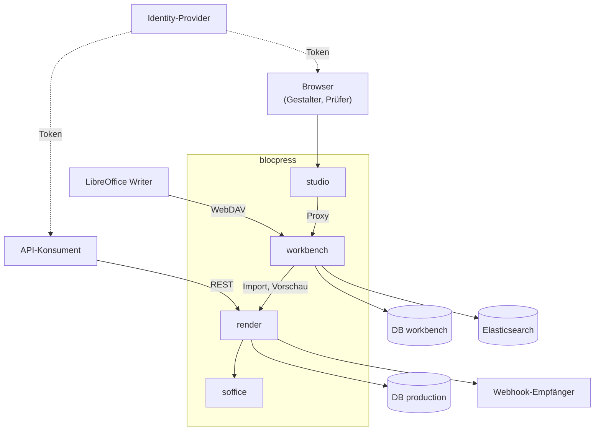

# Kontextabgrenzung

## Fachlicher Kontext

blocpress erzeugt Dokumente aus ODT-Vorlagen und JSON-Daten und verwaltet den Lebenszyklus
dieser Vorlagen von der Gestaltung bis zur Freigabe. Ein eigenes Prüf- oder
Administrationsmodul gibt es nicht: Die Freigabe liegt in der Workbench, Benutzer und Rollen
kommen aus einem externen Identity-Provider ([ADR-0003](09-decisions/ADR-0003.md)).

| Rolle | Arbeitet mit | Gibt hinein | Bekommt heraus |
|---|---|---|---|
| Vorlagengestalter (Designer) | LibreOffice Writer, Workbench über das Studio | ODT-Vorlagen und Textbausteine, Testdaten | Validierungsergebnis, Status, Vorschau, Abdeckung der Testdaten |
| Prüfer / Freigeber | Workbench über das Studio | Freigabe oder Ablehnung mit Begründung, Gültigkeitsbeginn, Review-Zyklus, Regressionstests | eingereichte Vorlagen, Testdokumente, PDF-Vergleiche, fällige Compliance-Reviews |
| API-Konsument (Anwendungssystem) | REST-API von blocpress-render | Vorlagenname oder Vorlage, JSON-Daten, Ausgabeformat, optional Webhook-URL | Dokument als PDF, RTF oder ODT, bei asynchronen Aufträgen Job-Status |
| Betreiber | Container, Datenbank, Identity-Provider | Konfiguration (Datenbank, Elasticsearch, JWT-Schlüssel, Worker-Zahl) | Health-Checks, Render-Dashboard |

Gestalter und Prüfer arbeiten in derselben Oberfläche an denselben Vorlagen
([US-0016](01-goals/stories/US-0016.md), [US-0018](01-goals/stories/US-0018.md),
[US-0019](01-goals/stories/US-0019.md)). Das Vier-Augen-Prinzip ist organisatorisch, nicht
technisch durchgesetzt; eine Rollenprüfung je API-Aufruf ist offen
([US-0021](01-goals/stories/US-0021.md)).

_(confidence: verified — Rollen aus dem Altbestand zusammengeführt und gegen
blocpress-workbench/…/TemplateResource.java (Einreichen, Ablehnen, Statuswechsel,
Regression, `due-for-review`) und blocpress-render/…/RenderResource.java,
AsyncRenderResource.java, RenderDashboardResource.java geprüft; derived_from:
arc42.adoc:82-113 legacy (git history), arc42.adoc:187-251 legacy (git history),
Solution_Design_Concept.adoc:73-87 legacy (git history),
System_Design_Concept.adoc:38-49 legacy (git history))_

Im Altbestand waren Testmanager und Compliance-Reviewer eigene Rollen; sie sind hier im
Prüfer aufgegangen, wie es schon das System Design Concept vorsah. Der Administrator mit
Benutzer- und Rechteverwaltung entfällt; was davon bleibt, ist der Betreiber.

## Technischer Kontext

| Nachbar | Richtung | Technik | Inhalt |
|---|---|---|---|
| API-Konsument | → render | HTTP/JSON, `POST /api/render/{name}` | Dokument aus freigegebener Vorlage nach Name, synchron ([US-0005](01-goals/stories/US-0005.md)) |
| API-Konsument | → render | HTTP, `POST /api/render/template` (Multipart oder JSON mit Base64) | Vorlage im Aufruf mitgeschickt, ohne Ablage ([US-0004](01-goals/stories/US-0004.md)) |
| API-Konsument | → render | HTTP/JSON, `POST /api/render/jobs`, `GET /api/render/jobs/{id}`, `GET /api/render/jobs/{id}/result` | asynchroner Auftrag ([US-0006](01-goals/stories/US-0006.md)) |
| Webhook-Empfänger | render → | HTTP POST, JSON `{jobId, status}` | Benachrichtigung bei DONE oder FAILED, ohne Wiederholung |
| Identity-Provider | → Aufrufer | JWT (Bearer) | Token; render prüft Signatur und Issuer nur, wenn `BLOCPRESS_AUTH_ENABLED` gesetzt ist ([ADR-0002](09-decisions/ADR-0002.md)) |
| Browser | → studio | HTTP, Web Components | Oberfläche; das Token wird über ein Eingabefeld übernommen und an die Workbench weitergereicht |
| LibreOffice Writer | → workbench | WebDAV unter `/api/webdav` | Entwürfe lesen und schreiben, freigegebene Stände unter `/api/webdav/released/` nur lesen ([US-0014](01-goals/stories/US-0014.md)) |
| workbench | → render | HTTP/JSON, `POST /api/render/templates/import`, `DELETE /api/render/templates/import/{name}` | Übergabe bei Freigabe, Entfernen bei Zurückziehen ([US-0017](01-goals/stories/US-0017.md)); mit eingeschalteter Absicherung mit dem durchgereichten Token des Benutzers, Gruppe `reviewer` ([ADR-0019](09-decisions/ADR-0019.md)) |
| PostgreSQL | workbench ↔ | JDBC, Datenbank `workbench` | Vorlagen, Textbausteine, Testdatensätze |
| PostgreSQL | render ↔ | JDBC, Datenbank `production` | freigegebene Vorlagen, Render-Aufträge |
| Elasticsearch | workbench → | REST, Index `blocpress-templates` | Volltextsuche über Vorlagen und Bausteine ([US-0015](01-goals/stories/US-0015.md)) |
| LibreOffice (`soffice`) | render → | Prozessaufruf, ein eigenes Profil je Konvertierung | ODT nach PDF oder RTF ([ADR-0004](09-decisions/ADR-0004.md)) |

Die Workbench prüft serverseitig kein Token ([ADR-0003](09-decisions/ADR-0003.md)).

_(confidence: verified — Pfade aus RenderResource.java, AsyncRenderResource.java,
TemplateImportResource.java, WebhookSender.java, WebDavResource.java, WorkbenchApiProxy.java,
bp-token-input.js, LibreOfficeProcessor.java; Datenbanken, Elasticsearch und Ports aus den
application.properties von workbench und render und aus docker/studio/supervisord.conf;
derived_from: arc42.adoc:253-326 legacy (git history),
System_Design_Concept.adoc:97-105 legacy (git history),
Element_Design_Concept.adoc:771-845 legacy (git history),
Element_Design_Concept.adoc:908-970 legacy (git history))_

Gegenüber dem Altbestand korrigiert: Der öffentliche Pfad ist nicht
`/api/documents/generate`, sondern die oben genannten Pfade unter `/api/render`. Die
Konvertierung läuft über einen `soffice`-Prozess, nicht über die UNO-API. Workbench und
render nutzen zwei getrennte Datenbanken, nicht Schemata einer Datenbank über
`currentSchema`. Eine Anbindung an OpenTelemetry gibt es nicht.

- UNKNOWN — offene Frage: Lädt render zur Laufzeit Textbausteine über die WebDAV-Adresse der Workbench nach, wenn eine freigegebene Vorlage auf sie verweist? Der Altbestand sagt ja; im Code löst blocpress-core ohne gesetzte System-Property blocpress.mode den Verweis (xlink:href) aus der Vorlage selbst auf, die Abhängigkeit render → workbench entstünde also nur über den Inhalt der Vorlage.
- UNKNOWN — offene Frage: Wie kommt ein Benutzer in einer produktiven Installation an sein Token? Das Studio kennt nur das Eingabefeld, keinen Anmeldeablauf gegen den Identity-Provider.
