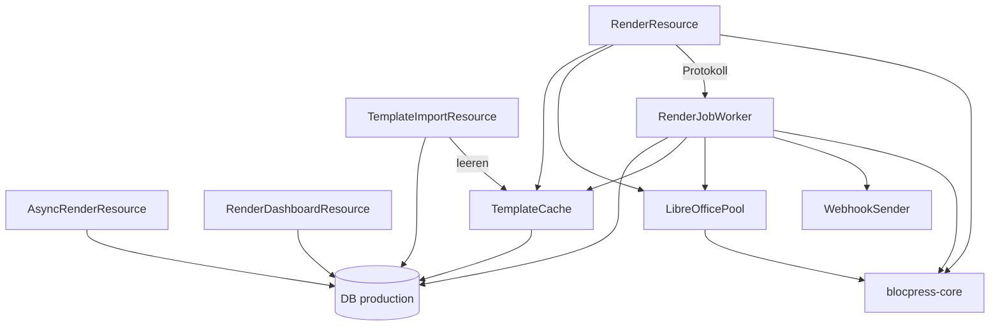

# Baustein blocpress-render

Render-Dienst: Quarkus-REST-Schnittstelle und Export über LibreOffice, ausgeliefert als
Container-Image.

Die REST-Schnittstelle liegt in `RenderResource` unter `/api/render`, z. B.
`POST /api/render/template` (Multipart). Sie nutzt `TemplateCache`, `LibreOfficePool` und
`RenderJobWorker`. Die Schnittstelle ist in `src/main/resources/META-INF/openapi.yml`
beschrieben.

_(confidence: verified — Pfade und Abhängigkeiten von `RenderResource` im Code geprüft)_

Die erzeugten Interfaces sind derzeit ungenutzt; wie das aufgelöst wird, entscheidet
[ADR-0013](../09-decisions/ADR-0013.md).

## Aufbau

| Schnittstelle | Klasse | Zweck |
|---|---|---|
| `POST /api/render/template` (Multipart oder JSON mit Base64) | `RenderResource` | Vorlage im Aufruf, ohne Ablage |
| `POST /api/render/{name}` | `RenderResource` | freigegebene Vorlage nach Name, siehe [Rendern per Name](../06-runtime/render-by-name.md) |
| `POST /api/render/jobs`, `GET /api/render/jobs/{id}`, `GET /api/render/jobs/{id}/result` | `AsyncRenderResource` | asynchroner Auftrag, siehe [Asynchroner Render-Auftrag](../06-runtime/async-render-job.md) |
| `GET /api/render/dashboard`, `GET /api/render/dashboard/jobs?status=&limit=` | `RenderDashboardResource` | Zahlen je Status und letzte Aufträge als JSON |
| `POST /api/render/templates/import`, `DELETE /api/render/templates/import/{name}` | `TemplateImportResource` | Übergabe freigegebener Vorlagen aus der Workbench, Entfernen beim Zurückziehen |

Mit `BLOCPRESS_AUTH_ENABLED=true` verlangen alle Pfade unter `/api/render/` ein gültiges
Token, die beiden Import-Pfade zusätzlich die Gruppe `reviewer` (sonst 403,
[ADR-0019](../09-decisions/ADR-0019.md)); ausgeschaltet ist der Import offen. Beim Start bricht render ab, wenn
die Absicherung an ist, aber kein Schlüssel konfiguriert ist (`RenderAuthConfig`), oder wenn
die Standard-Locale `BLOCPRESS_DEFAULT_LOCALE` (Standard `de-DE`) ungültig ist
(`RenderLocaleConfig`).

_(confidence: verified — RenderResource.java, AsyncRenderResource.java,
RenderDashboardResource.java, TemplateImportResource.java, RenderAuthConfig.java,
RenderLocaleConfig.java, blocpress-render/src/main/resources/application.properties;
derived_from: arc42.adoc:661-728 legacy (git history))_

### Worker

`RenderJobWorker` arbeitet die Tabelle `render_job` ab
([ADR-0012](../09-decisions/ADR-0012.md)): `dispatch` startet im Takt
`BLOCPRESS_ASYNC_POLL_INTERVAL` (Standard 2 s) so viele Schleifen, wie es Worker gibt, in einem
festen Thread-Pool dieser Größe, jede holt Aufträge mit `FOR UPDATE SKIP LOCKED`, bis keiner
mehr wartet. Minütlich setzt `requeueStaleJobs` hängende Aufträge zurück
(`BLOCPRESS_ASYNC_STALE_AFTER`, Standard 10 Minuten), stündlich räumt `cleanupJobs` auf
(`BLOCPRESS_ASYNC_RESULT_RETENTION` 24 Stunden, `BLOCPRESS_ASYNC_RECORD_RETENTION` 7 Tage).
Außerdem protokolliert `recordSync` jeden synchronen Aufruf als `RenderJob` ohne Ergebnis.
Den Ablauf im Einzelnen beschreibt der [asynchrone Render-Auftrag](../06-runtime/async-render-job.md).

### Betriebsarten

render läuft als `full` (Standard, mit Datenbank `production`) oder als `engine`
(`BLOCPRESS_MODE=engine`, ohne Datenbank, [ADR-0016](../09-decisions/ADR-0016.md)). Im
Engine-Modus setzt `EngineModeConfig`, ein Config-Interceptor von SmallRye Config, zur Laufzeit
Datenquelle, Hibernate ORM, Scheduler und den Datenbank-Check der Readiness auf inaktiv; render
startet und rendert ohne Datenbank ([REQ-0068](../01-goals/requirements/REQ-0068.md),
[REQ-0070](../01-goals/requirements/REQ-0070.md)). `EngineModeFilter` weist vor dem Routing alle
Pfade unter `/api/` außer `POST /api/render/template` mit 404 und einer Meldung ab, die den Modus
nennt ([REQ-0069](../01-goals/requirements/REQ-0069.md)). Die Eigenschaft heißt
`blocpress.render.mode`, nicht `blocpress.mode`: Das ist in core ein System-Property für die
Auflösung von Bausteinen.

> [!CAUTION]
> ADR-0016 sagt „umgesetzt als Quarkus-Profil“; der Code wählt den Modus über einen
> Config-Interceptor (`EngineModeConfig`), weil sich das Profil nicht aus `BLOCPRESS_MODE`
> ableiten lässt, ohne die Variable `QUARKUS_PROFILE` zu verlangen. (contradiction)

_(confidence: verified — EngineModeConfig.java, EngineModeFilter.java,
META-INF/services/io.smallrye.config.ConfigSourceInterceptor, application.properties; natives
Image ohne Datenbank gestartet 2026-10-10: bereit nach ~2 s, 117 MiB)_

### LibreOffice

`LibreOfficePool` hält je Worker eine warme LibreOffice-Instanz ([ADR-0021](../09-decisions/ADR-0021.md)).
Jede Instanz ist ein Helferprozess (`bp-convert.py`, Python-UNO), der eine eigene `soffice`-Instanz
mit eigenem Profil an einer lokalen Pipe startet; render spricht mit ihm über stdin/stdout
(`READY`, `CONVERT`, `PROGRESS`, `OK`/`FAIL`). Beim Start legt der Pool alle Instanzen an;
die Readiness „LibreOffice instances“ ist erst grün, wenn alle laufen
([REQ-0098](../01-goals/requirements/REQ-0098.md)). Eine Konvertierung nimmt eine freie Instanz
und läuft darin ohne neuen Prozess ([REQ-0099](../01-goals/requirements/REQ-0099.md)).

Die Zahl der Worker bestimmt `WorkerCount`: das CPU-Limit aus `cpu.max`, abgerundet und
mindestens 1, ohne Limit die Prozessorzahl; `BLOCPRESS_LO_WORKERS` ist eine Obergrenze
([REQ-0027](../01-goals/requirements/REQ-0027.md)). Zusätzlich begrenzt das Speicherlimit
(`memory.max`): Grundbedarf plus Bedarf je Instanz (Standard 350 MiB) müssen hineinpassen; den
Grundbedarf misst render beim Start selbst (eigener Speicher plus 128 MiB)
([REQ-0103](../01-goals/requirements/REQ-0103.md)). Synchrone Aufrufe und Auftragsschleifen
teilen sich die Instanzen.

Eine Instanz wird ersetzt, wenn eine Konvertierung 30 s keinen Fortschritt meldet
([REQ-0100](../01-goals/requirements/REQ-0100.md)) oder länger als 10 min dauert
([REQ-0104](../01-goals/requirements/REQ-0104.md)) — der Aufruf scheitert dann mit einer
Meldung, die das Limit nennt —, wenn sie abstürzt ([REQ-0102](../01-goals/requirements/REQ-0102.md))
oder nach 500 Konvertierungen bzw. über 512 MiB ([REQ-0101](../01-goals/requirements/REQ-0101.md));
ihr Platz bleibt so lange belegt. Fortschritt meldet der Helfer nach dem Laden und je Seite
beim Export; beim Laden fragt er ihn nicht ab, weil LibreOffice dort zehntausendfach
zurückruft ([Messprotokoll](../guides/measurements/libreoffice-warm-2026-10-10.md)).

| Variable | Standard | Wirkung |
|---|---|---|
| `BLOCPRESS_LO_WORKERS` | nicht gesetzt | Obergrenze der Worker |
| `BLOCPRESS_LO_IDLE_TIMEOUT` | `30s` | Zeit ohne Fortschritt bis zum Abbruch |
| `BLOCPRESS_LO_MAX_DURATION` | `10m` | Höchstdauer einer Konvertierung |
| `BLOCPRESS_LO_MAX_CONVERSIONS` | `500` | Konvertierungen, nach denen eine Instanz ersetzt wird |
| `BLOCPRESS_LO_MAX_MEMORY_MB` | `512` | Speicher einer Instanz, ab dem sie ersetzt wird |
| `BLOCPRESS_LO_MEMORY_BASE_MB` | gemessen | Grundbedarf von render für die Worker-Zahl |
| `BLOCPRESS_LO_MEMORY_PER_INSTANCE_MB` | `350` | Bedarf je Instanz für die Worker-Zahl |

`LibreOfficeProcessor` in core (ein `soffice`-Prozess je Konvertierung) bleibt für die Nutzung
als Bibliothek; render verwendet ihn nicht mehr.

_(confidence: verified — RenderJobWorker.java, RenderJob.java (`claimNextPending`),
LibreOfficePool.java, LibreOfficeInstance.java, LibreOfficeReadiness.java, WorkerCount.java,
src/main/resources/libreoffice/bp-convert.py, application.properties)_

### Cache

`TemplateCache` ermittelt bei jedem Rendern per Name (Vorlage oder Baustein) die `id` der
gültigen Version aus der Datenbank (`ProductionTemplate.findValidId`, ohne Inhalt).
`TemplateContentCache` hält nur den Inhalt je `id` im Quarkus-Cache `template-content`
(Caffeine, höchstens 300 Einträge, eine Stunde nach dem letzten Zugriff); der Inhalt einer `id`
ändert sich nicht, ein Import mit derselben `id` verwirft ihn. Ablauf, Zurückziehen und neue
Versionen wirken so sofort und auf allen Instanzen
([REQ-0063](../01-goals/requirements/REQ-0063.md), siehe
[Rendern per Name](../06-runtime/render-by-name.md)).

_(confidence: verified — TemplateCache.java, TemplateContentCache.java, TemplateImportResource.java,
application.properties)_

### WebhookSender

Schickt nach Abschluss eines Auftrags `{"jobId": …, "status": …}` per POST an die
`webhookUrl`, bei `DONE` und bei `FAILED`, in einem eigenen virtuellen Thread. Verbindungsaufbau
höchstens 5 s, Anfrage höchstens 10 s. Es gibt keine Wiederholung, keine Signatur und keine
Prüfung der Ziel-URL; Fehler werden nur geloggt.

_(confidence: verified — WebhookSender.java)_

### Dashboard

`RenderDashboardResource` liefert nur JSON, eine Oberfläche dazu gibt es in render nicht.
`GET /api/render/dashboard` zählt die Aufträge je Status (`PENDING`, `PROCESSING`, `DONE`,
`FAILED`) und gesamt. `GET …/dashboard/jobs` liefert die neuesten Aufträge ohne Daten und
Ergebnis, Standard 50, höchstens 200, optional nach Status gefiltert. Die Zahlen enthalten die
protokollierten synchronen Aufrufe.

Zwei Schwächen im Code: `listJobs` lädt alle passenden Aufträge samt Ergebnis-Bytes aus der
Datenbank und kürzt erst im Speicher auf das Limit. Ein unbekannter Wert für `status` führt
zu einer unbehandelten `IllegalArgumentException` statt zu 400.

_(confidence: verified — RenderDashboardResource.java; blocpress-render/src/main/resources/META-INF/resources
enthält nur eine Startseite)_

### Import

`TemplateImportResource` nimmt die Übergabe aus der Workbench an
([US-0017](../01-goals/stories/US-0017.md)): `POST` prüft `id`, `name`, `version`,
`contentBase64` und `validFrom` (sonst 400), löscht einen Eintrag mit derselben ID und legt ihn
neu an, mit `validUntil`, falls angegeben; dabei endet die bis dahin gültige Version desselben
Namens am Beginn der neuen ([REQ-0040](../01-goals/requirements/REQ-0040.md)). `DELETE …/{name}`
löscht nichts, sondern beendet jetzt die Gültigkeit aller noch gültigen oder künftigen Versionen
des Namens ([REQ-0037](../01-goals/requirements/REQ-0037.md)).
Die Endpunkte sind ohne Anmeldung erreichbar und sollen nur im internen Netz liegen; render
selbst schränkt das nicht ein.

_(confidence: verified — TemplateImportResource.java, application.properties
(`quarkus.http.auth.permission.internal`))_

Gegenüber dem Altbestand korrigiert: render liest nicht das Schema `production` einer
gemeinsamen Datenbank, sondern die eigene Datenbank `production`. Der Worker holt nicht einen
Auftrag je Takt; die gültige Version ermittelt `findValidId`, das auch `validUntil`
beachtet. LibreOffice läuft seit [ADR-0021](../09-decisions/ADR-0021.md) in warmen Instanzen über
Python-UNO, nicht über Java-UNO oder JODConverter (nicht mit Native Image vereinbar); eine
Repository-Schicht oder einen Storage-Service gibt es nicht, die Entitäten nutzen Panache.

## Umgesetzte Requirements

<!-- generated:realized -->
- [REQ-0006](../01-goals/requirements/REQ-0006.md) WHEN a number, currency, percentage or date style referenced by a user field declares no language, the render engine shall format the value using the default locale supplied by the caller, independent of the operating-system locale.
- [REQ-0007](../01-goals/requirements/REQ-0007.md) IF the configured default locale is not a valid BCP-47 tag or no number-format data is available for it at runtime, THEN the render service shall refuse to start with an error naming the locale.
- [REQ-0012](../01-goals/requirements/REQ-0012.md) WHERE PDF or RTF output is requested, the render engine shall convert the merged document to that format with a headless LibreOffice process provided by the core library.
- [REQ-0014](../01-goals/requirements/REQ-0014.md) WHEN a reviewer approves a submitted template, the workbench shall transfer the unchanged template content to the production store of the render service exactly once.
- [REQ-0022](../01-goals/requirements/REQ-0022.md) IF the expiry date of a template has passed, THEN the render service shall not render it by name and answer with status 404.
- [REQ-0027](../01-goals/requirements/REQ-0027.md) The render service shall run as many LibreOffice conversions in parallel as the CPU quota of its container allows in whole cores, at least one, and no more than the configured worker limit where one is set.
- [REQ-0028](../01-goals/requirements/REQ-0028.md) WHEN workbench or render starts against a PostgreSQL database that is empty or was created before schema migrations existed, the service shall bring the schema to the state its entities expect before it accepts requests, without losing existing data.
- [REQ-0033](../01-goals/requirements/REQ-0033.md) WHEN a template rendered by name contains a section linked to a path ending in /bausteine/{name}.odt, the render service shall inline the building block of that name valid at render time from its production store, without accessing the linked location.
- [REQ-0034](../01-goals/requirements/REQ-0034.md) IF a linked section of a template rendered by name does not match a path ending in /bausteine/{name}.odt or no valid building block of that name exists, THEN the render service shall reject the request with HTTP 422 without technical details of the failure.
- [REQ-0035](../01-goals/requirements/REQ-0035.md) IF a template sent with the request contains a linked section, THEN the render service shall reject the request with HTTP 422.
- [REQ-0036](../01-goals/requirements/REQ-0036.md) The render service shall render by name only templates and shall inline only building blocks.
- [REQ-0037](../01-goals/requirements/REQ-0037.md) The render service shall keep every approved version in its production store; IF a version is retired, THEN the render service shall end its validity instead of deleting it.
- [REQ-0038](../01-goals/requirements/REQ-0038.md) The render service shall use the version that is valid at the moment of rendering, also when a version is cached.
- [REQ-0040](../01-goals/requirements/REQ-0040.md) WHEN a version is approved, the workbench shall end the validity of the version valid until then at the start of validity of the new one, so that at most one version of a name is valid at any time.
- [REQ-0050](../01-goals/requirements/REQ-0050.md) The container images of render, workbench and studio shall run the service process as a non-root user with a numeric UID.
- [REQ-0063](../01-goals/requirements/REQ-0063.md) WHEN the production store changes, the render service shall use the changed state for the next rendering, regardless of which instance made the change.
- [REQ-0067](../01-goals/requirements/REQ-0067.md) The render service shall send the header X-Content-Type-Options with the value nosniff with every response.
- [REQ-0068](../01-goals/requirements/REQ-0068.md) WHERE the render service runs in engine mode, the render service shall start and render templates sent with the request without a database.
- [REQ-0069](../01-goals/requirements/REQ-0069.md) WHERE the render service runs in engine mode, IF a request targets rendering by name, jobs, the dashboard or the import, THEN the render service shall reject it with HTTP 404 and a message that names the mode, without internal details.
- [REQ-0070](../01-goals/requirements/REQ-0070.md) WHERE the render service runs in engine mode, the render service shall run no scheduled task and shall report readiness without a database check.
- [REQ-0098](../01-goals/requirements/REQ-0098.md) WHEN the render service starts, the render service shall start one LibreOffice instance per worker and report readiness only after all instances accept conversions.
- [REQ-0099](../01-goals/requirements/REQ-0099.md) The render service shall convert documents in a running LibreOffice instance without starting a new LibreOffice process per conversion.
- [REQ-0100](../01-goals/requirements/REQ-0100.md) IF a conversion reports no progress for the configured idle time, 30 seconds by default, THEN the render service shall terminate and replace the instance and fail the request with an error that names the limit.
- [REQ-0101](../01-goals/requirements/REQ-0101.md) WHEN an instance has completed the configured number of conversions or its memory exceeds the configured limit, the render service shall replace it before its next conversion.
- [REQ-0102](../01-goals/requirements/REQ-0102.md) IF an instance terminates unexpectedly, THEN the render service shall replace it and fail only the conversion that was running.
- [REQ-0103](../01-goals/requirements/REQ-0103.md) The render service shall run no more conversions in parallel than the memory limit of its container allows for its base need plus the need per instance, and at least one.
- [REQ-0104](../01-goals/requirements/REQ-0104.md) IF a conversion exceeds the configured maximum duration, 10 minutes by default, THEN the render service shall terminate and replace the instance and fail the request with an error that names the limit.
<!-- /generated -->
