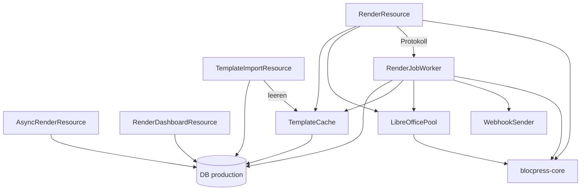

# Baustein blocpress-render

Render-Dienst: Quarkus-REST-Schnittstelle und Export über LibreOffice, ausgeliefert als
Container-Image.

Die REST-Schnittstelle liegt in `RenderResource` unter `/api/render`, z. B.
`POST /api/render/template` (Multipart). Sie nutzt `TemplateCache`, `LibreOfficePool` und
`RenderJobWorker`. Die Schnittstelle ist in `src/main/resources/META-INF/openapi.yml`
beschrieben.

_(confidence: verified — Pfade und Abhängigkeiten von `RenderResource` im Code geprüft)_

Die erzeugten Interfaces sind derzeit ungenutzt; wie das aufgelöst wird, entscheidet
[ADR-0013](../09-decisions/ADR-0013.md).

## Aufbau

| Schnittstelle | Klasse | Zweck |
|---|---|---|
| `POST /api/render/template` (Multipart oder JSON mit Base64) | `RenderResource` | Vorlage im Aufruf, ohne Ablage |
| `POST /api/render/{name}` | `RenderResource` | freigegebene Vorlage nach Name, siehe [Rendern per Name](../06-runtime/render-by-name.md) |
| `POST /api/render/jobs`, `GET /api/render/jobs/{id}`, `GET /api/render/jobs/{id}/result` | `AsyncRenderResource` | asynchroner Auftrag, siehe [Asynchroner Render-Auftrag](../06-runtime/async-render-job.md) |
| `GET /api/render/dashboard`, `GET /api/render/dashboard/jobs?status=&limit=` | `RenderDashboardResource` | Zahlen je Status und letzte Aufträge als JSON |
| `POST /api/render/templates/import`, `DELETE /api/render/templates/import/{name}` | `TemplateImportResource` | Übergabe freigegebener Vorlagen aus der Workbench, Entfernen beim Zurückziehen |

Mit `BLOCPRESS_AUTH_ENABLED=true` verlangen alle Pfade unter `/api/render/` ein gültiges
Token, außer den beiden Import-Pfaden, die immer offen sind. Beim Start bricht render ab, wenn
die Absicherung an ist, aber kein Schlüssel konfiguriert ist (`RenderAuthConfig`), oder wenn
die Standard-Locale `BLOCPRESS_DEFAULT_LOCALE` (Standard `de-DE`) ungültig ist
(`RenderLocaleConfig`).

_(confidence: verified — RenderResource.java, AsyncRenderResource.java,
RenderDashboardResource.java, TemplateImportResource.java, RenderAuthConfig.java,
RenderLocaleConfig.java, blocpress-render/src/main/resources/application.properties;
derived_from: arc42.adoc:661-728 legacy (git history))_

### Worker

`RenderJobWorker` arbeitet die Tabelle `render_job` ab
([ADR-0012](../09-decisions/ADR-0012.md)): `dispatch` startet im Takt
`BLOCPRESS_ASYNC_POLL_INTERVAL` (Standard 2 s) so viele Schleifen, wie es Worker gibt, in einem
festen Thread-Pool dieser Größe, jede holt Aufträge mit `FOR UPDATE SKIP LOCKED`, bis keiner
mehr wartet. Minütlich setzt `requeueStaleJobs` hängende Aufträge zurück
(`BLOCPRESS_ASYNC_STALE_AFTER`, Standard 10 Minuten), stündlich räumt `cleanupJobs` auf
(`BLOCPRESS_ASYNC_RESULT_RETENTION` 24 Stunden, `BLOCPRESS_ASYNC_RECORD_RETENTION` 7 Tage).
Außerdem protokolliert `recordSync` jeden synchronen Aufruf als `RenderJob` ohne Ergebnis.
Den Ablauf im Einzelnen beschreibt der [asynchrone Render-Auftrag](../06-runtime/async-render-job.md).

`LibreOfficePool` ist kein Prozess-Pool, sondern ein faires Semaphor mit
so vielen Plätzen, wie es Worker gibt, vor `LibreOfficeProcessor.refreshAndTransform`. Die
Zahl bestimmt `WorkerCount`: das CPU-Limit aus `cpu.max`, abgerundet und mindestens 1, ohne
Limit die Prozessorzahl; `BLOCPRESS_LO_WORKERS` ist eine Obergrenze
([REQ-0027](../01-goals/requirements/REQ-0027.md)).
Synchrone Aufrufe und Auftragsschleifen teilen sich diese Plätze.

_(confidence: verified — RenderJobWorker.java, RenderJob.java (`claimNextPending`),
LibreOfficePool.java, application.properties)_

### Cache

`TemplateCache` hält den Inhalt freigegebener Vorlagen im Quarkus-Cache `templates`
(Caffeine, höchstens 100 Einträge, 10 Minuten nach dem Schreiben). Genutzt wird nur der
Zugriff nach Name (`getTemplateContentByName`); der Zugriff nach ID (`getTemplateContent`)
hat keinen Aufrufer. Ein Import leert den ganzen Cache, das Entfernen nur den Eintrag des
Namens, jeweils nur in der Instanz, die den Aufruf erhält. Was daraus für Ablaufdatum und
mehrere Instanzen folgt, steht beim [Rendern per Name](../06-runtime/render-by-name.md).

_(confidence: verified — TemplateCache.java, TemplateImportResource.java, application.properties)_

### WebhookSender

Schickt nach Abschluss eines Auftrags `{"jobId": …, "status": …}` per POST an die
`webhookUrl`, bei `DONE` und bei `FAILED`, in einem eigenen virtuellen Thread. Verbindungsaufbau
höchstens 5 s, Anfrage höchstens 10 s. Es gibt keine Wiederholung, keine Signatur und keine
Prüfung der Ziel-URL; Fehler werden nur geloggt.

_(confidence: verified — WebhookSender.java)_

### Dashboard

`RenderDashboardResource` liefert nur JSON, eine Oberfläche dazu gibt es in render nicht.
`GET /api/render/dashboard` zählt die Aufträge je Status (`PENDING`, `PROCESSING`, `DONE`,
`FAILED`) und gesamt. `GET …/dashboard/jobs` liefert die neuesten Aufträge ohne Daten und
Ergebnis, Standard 50, höchstens 200, optional nach Status gefiltert. Die Zahlen enthalten die
protokollierten synchronen Aufrufe.

Zwei Schwächen im Code: `listJobs` lädt alle passenden Aufträge samt Ergebnis-Bytes aus der
Datenbank und kürzt erst im Speicher auf das Limit. Ein unbekannter Wert für `status` führt
zu einer unbehandelten `IllegalArgumentException` statt zu 400.

_(confidence: verified — RenderDashboardResource.java; blocpress-render/src/main/resources/META-INF/resources
enthält nur eine Startseite)_

### Import

`TemplateImportResource` nimmt die Übergabe aus der Workbench an
([US-0017](../01-goals/stories/US-0017.md)): `POST` prüft `id`, `name`, `version`,
`contentBase64` und `validFrom` (sonst 400), löscht einen Eintrag mit derselben ID und legt ihn
neu an, mit `validUntil`, falls angegeben. `DELETE …/{name}` löscht alle Versionen des Namens.
Die Endpunkte sind ohne Anmeldung erreichbar und sollen nur im internen Netz liegen; render
selbst schränkt das nicht ein.

_(confidence: verified — TemplateImportResource.java, application.properties
(`quarkus.http.auth.permission.internal`))_

Gegenüber dem Altbestand korrigiert: render liest nicht das Schema `production` einer
gemeinsamen Datenbank, sondern die eigene Datenbank `production`. Der Worker holt nicht einen
Auftrag je Takt; der Cache wird über `findLatestActiveByName` gefüllt, das auch `validUntil`
beachtet. LibreOffice läuft als `soffice`-Prozess je Konvertierung, nicht über UNO; eine
Repository-Schicht oder einen Storage-Service gibt es nicht, die Entitäten nutzen Panache.

## Umgesetzte Requirements

<!-- generated:realized -->
- [REQ-0004](../01-goals/requirements/REQ-0004.md) WHERE an output type of PDF or RTF is requested, the render engine shall convert the merged ODT document to that format using a headless LibreOffice process.
- [REQ-0006](../01-goals/requirements/REQ-0006.md) WHEN a number, currency, percentage or date style referenced by a user field declares no language, the render engine shall format the value using the default locale supplied by the caller, independent of the operating-system locale.
- [REQ-0007](../01-goals/requirements/REQ-0007.md) IF the configured default locale is not a valid BCP-47 tag or no number-format data is available for it at runtime, THEN the render service shall refuse to start with an error naming the locale.
- [REQ-0008](../01-goals/requirements/REQ-0008.md) WHERE JWT authentication is enabled, the render service shall reject requests to the rendering, job and dashboard endpoints that carry no valid bearer token with HTTP 401; while it is disabled, these endpoints shall remain accessible without a token.
- [REQ-0009](../01-goals/requirements/REQ-0009.md) IF JWT authentication is enabled and no token verification key is configured, THEN the render service shall refuse to start with an error naming the missing setting.
- [REQ-0012](../01-goals/requirements/REQ-0012.md) WHERE PDF or RTF output is requested, the render engine shall convert the merged document to that format with a headless LibreOffice process provided by the core library.
- [REQ-0014](../01-goals/requirements/REQ-0014.md) WHEN a reviewer approves a submitted template, the workbench shall transfer the unchanged template content to the production store of the render service exactly once.
- [REQ-0022](../01-goals/requirements/REQ-0022.md) IF the expiry date of a template has passed, THEN the render service shall not render it by name and answer with status 404.
- [REQ-0027](../01-goals/requirements/REQ-0027.md) The render service shall run as many LibreOffice conversions in parallel as the CPU quota of its container allows in whole cores, at least one, and no more than the configured worker limit where one is set.
- [REQ-0028](../01-goals/requirements/REQ-0028.md) WHEN workbench or render starts against a PostgreSQL database that is empty or was created before schema migrations existed, the service shall bring the schema to the state its entities expect before it accepts requests, without losing existing data.
<!-- /generated -->
