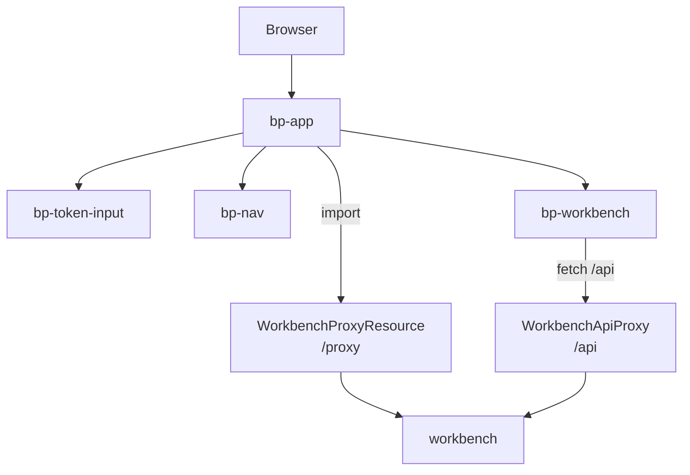

# Baustein blocpress-studio

Oberfläche. _(confidence: verified — Modulstruktur im Code; übernommen aus dem
arc42-Gerüst, Detail folgt entlang der Änderungen)_

Das Studio ist die Portal-Shell im Browser und der einzige öffentliche Einstieg zur
Workbench: Es liefert die Oberfläche aus, lädt die Web Component der Workbench und leitet
API-Aufrufe an die interne Workbench weiter
([US-0023](../01-goals/stories/US-0023.md), [US-0024](../01-goals/stories/US-0024.md),
[US-0025](../01-goals/stories/US-0025.md)). Es hat keine Datenbank und prüft keine Tokens.
Statische Dateien liefert es ohne Browser-Cache aus
(`quarkus.http.static-resources.caching-enabled=false`). Port 8082, die Workbench-Adresse
kommt aus `WORKBENCH_URL` (Standard `http://localhost:8082`).

_(confidence: verified — blocpress-studio/src/main/java/…/studio, application.properties,
blocpress-studio/pom.xml; derived_from: arc42.adoc:542-544 legacy (git history))_

## Aufbau

**Portal-Shell.** `index.html` lädt Lit 3.2.1 über eine Import-Map von `esm.sh`; der Browser
braucht dafür Zugang zum Internet. `bp-app` baut Kopfzeile, Navigation und Inhalt auf,
`bp-router` liest die Route aus dem Hash (`#/workbench`, Standard `workbench`). `bp-nav` zeigt
den Eintrag Workbench und einen deaktivierten Eintrag Admin, ein Überbleibsel des entfallenen
Moduls ([ADR-0003](../09-decisions/ADR-0003.md)); jede andere Route zeigt „Coming soon“.

**Laden der Workbench.** `bp-app` importiert `/proxy/bp-workbench.js` dynamisch, mit
wechselndem `?v=` gegen den Cache und bis zu drei Versuchen im Abstand von 2 s.
`WorkbenchProxyResource` holt die Datei von `<WORKBENCH_URL>/components/bp-workbench.js`,
versucht es bis zu fünfmal im Abstand von 1,5 s und verwirft Antworten, die mit `<` beginnen
(HTML während eines Neustarts im Dev-Modus). Gelingt es nicht, liefert der Proxy trotzdem 200
mit JavaScript, das einen lesbaren Fehler wirft, weil der Browser sonst nur „error loading
dynamically imported module“ meldet. Same-Origin vermeidet CORS für den Modul-Import.

**API-Proxy.** `WorkbenchApiProxy` leitet `GET`, `POST`, `PUT`, `DELETE` und die für WebDAV
nötigen `OPTIONS`, `HEAD`, `PROPFIND`, `LOCK` und `UNLOCK` auf `/api/*` samt Query an
`<WORKBENCH_URL>/api/*` weiter ([REQ-0029](../01-goals/requirements/REQ-0029.md)). Mitgegeben
werden `Content-Type`, `Authorization`, `Accept` und die WebDAV-Header `Depth`, `Destination`,
`Overwrite`, `If`, `Lock-Token`, `Timeout`, `If-Match`, `If-None-Match`. Zurück kommen Status,
Inhalt und alle Header außer den hop-by-hop-Headern und `Content-Length`; eine `Location`, die
auf die Workbench zeigt, wird serverrelativ.
Verbindungsaufbau höchstens 10 s, Antwort höchstens 120 s. `bp-workbench` bekommt als
`api-base-url` einen leeren Wert und ruft damit dieselbe Origin; früher gespeicherte absolute
Adressen (`bp-workbench-url` im `localStorage`) werden verworfen.

_(confidence: verified — index.html, components/bp-app.js, bp-router.js, bp-nav.js,
WorkbenchProxyResource.java, WorkbenchApiProxy.java)_

WebDAV-Clients wie LibreOffice arbeiten deshalb über das Studio
(`<Studio>/api/webdav/…`), die Workbench muss nicht erreichbar sein. Die Standardadresse im Code unterscheidet sich zwischen den beiden Proxy-Klassen
(8082 und 8081); wirksam ist der Wert aus `application.properties`.

_(confidence: verified — WorkbenchApiProxy.java, WorkbenchProxyResource.java,
application.properties)_

## Token

`bp-token-input` nimmt ein Token über ein Textfeld entgegen und legt es im `localStorage`
unter `bp-jwt` ab; „Clear“ entfernt es. `bp-app` zeigt die Workbench erst, wenn irgendein
Token gesetzt ist, und reicht es als Eigenschaft `jwt` an `bp-workbench` weiter. Das Studio
prüft weder Form noch Signatur noch Ablauf; es gibt keine Anmeldung gegen einen
Identity-Provider. `bp-workbench` schickt das Token als `Authorization: Bearer` bei
Suche, Vorschau, Regression und Statuswechsel mit; die Workbench reicht es an render weiter,
prüft es aber nicht
([ADR-0003](../09-decisions/ADR-0003.md)). Der Hinweis in der Oberfläche nennt für den
Quickstart das veröffentlichte Beispiel-Token (`samples/quickstart/token.txt` der Website).

_(confidence: verified — bp-token-input.js, bp-app.js,
blocpress-workbench/src/main/resources/META-INF/resources/components/bp-workbench.js)_

Gegenüber dem Altbestand korrigiert: Das Studio ist kein Token-Guard mit Prüfung, sondern
nur eine Sperre der Ansicht. Es lädt nur die Workbench als Web Component, keine Oberflächen
von proof oder admin.

- UNKNOWN — offene Frage: Soll das Studio das Token bei allen Aufrufen der Workbench mitsenden, solange die Workbench es nicht prüft, oder entfällt das Eingabefeld, bis eine Anmeldung gegen den Identity-Provider existiert?

## Umgesetzte Requirements

<!-- generated:realized -->
- [REQ-0029](../01-goals/requirements/REQ-0029.md) WHEN a client sends a WebDAV request (OPTIONS, HEAD, PROPFIND, LOCK, UNLOCK, GET, PUT) to the studio below /api/webdav, the studio shall forward it with its body and WebDAV headers to the workbench and return the workbench response with its status and headers, making a Location that points to the workbench server-relative.
- [REQ-0050](../01-goals/requirements/REQ-0050.md) The container images of render, workbench and studio shall run the service process as a non-root user with a numeric UID.
<!-- /generated -->
