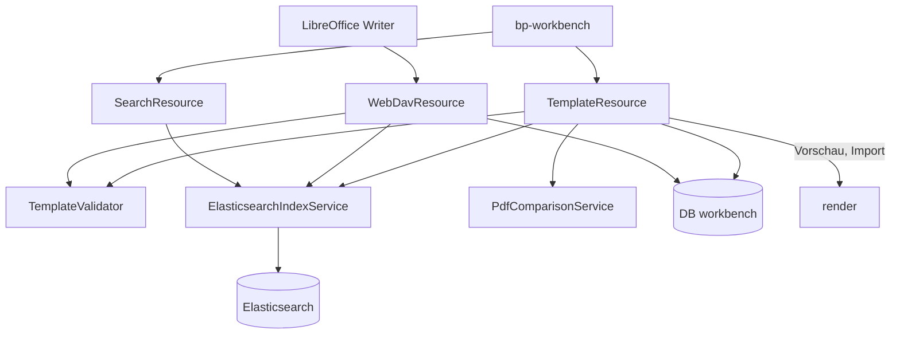

# Baustein blocpress-workbench

Lebenszyklus der Vorlagen. _(confidence: verified — Modulstruktur im Code; übernommen aus dem
arc42-Gerüst, Detail folgt entlang der Änderungen)_

Die Workbench ist der Arbeitsplatz für Gestalter und Prüfer: Vorlagen und Textbausteine
hochladen, validieren, versionieren, mit Testdaten in der Vorschau rendern, per
Regressionstest absichern, durchsuchen, einreichen, freigeben, ablehnen und zurückziehen.
Bei der Freigabe übergibt sie die Vorlage an render. Sie hat eine eigene Datenbank
`workbench` und einen Elasticsearch-Index; LibreOffice braucht sie nicht, gerendert wird über
render. Ihre Oberfläche ist die Web Component `bp-workbench`, die das
[Studio](studio.md) lädt.

_(confidence: verified — blocpress-workbench/src/main/java/…/workbench, application.properties,
blocpress-workbench/Dockerfile; derived_from: arc42.adoc:545-550 legacy (git history),
arc42.adoc:576-621 legacy (git history))_

## Aufbau

| Schnittstelle | Klasse | Zweck |
|---|---|---|
| `/api/workbench/templates/…` | `TemplateResource` | Hochladen, Inhalt ersetzen, Duplizieren, Statuswechsel, Einreichen, Ablehnen, Vorschau, Testdaten, Regression, Abdeckung, fällige Reviews |
| `GET /api/workbench/search?q=&type=&status=&from=&size=` | `SearchResource` | Volltextsuche ([US-0015](../01-goals/stories/US-0015.md)) |
| `/api/webdav/…` | `WebDavResource` | Bearbeiten in LibreOffice ([US-0014](../01-goals/stories/US-0014.md)) |

| Klasse | Aufgabe |
|---|---|
| `TemplateValidator` | prüft eine hochgeladene ODT-Datei und erzeugt das JSON-Schema der Daten (mit `JsonSchemaGenerator`) |
| `ElasticsearchIndexService` | legt den Index `blocpress-templates` an, indiziert, sucht |
| `TestDataSetService`, `CoverageAnalysisService` | Testdatensätze mit erwartetem PDF, Abdeckung der Bedingungen durch die Testdaten |
| `PdfComparisonService` | vergleicht gerenderte mit erwarteten PDFs über `pdftotext`, `pdftoppm` und ImageMagick `convert` |
| `ComplianceReviewScheduler` | täglich um 8 Uhr: loggt freigegebene Vorlagen, deren `validUntil` innerhalb von `BLOCPRESS_COMPLIANCE_LEAD_DAYS` (Standard 60) liegt |

Die Workbench ruft render über `RENDER_URL` auf: `POST /api/render/template` für Vorschau
und Regression, `POST /api/render/templates/import` bei der Freigabe, `DELETE
/api/render/templates/import/{name}` beim Zurückziehen, jeweils mit dem `HttpClient` des JDK.
Bei Import und Entfernen reicht sie den `Authorization`-Header des Benutzers unverändert durch
([REQ-0056](../01-goals/requirements/REQ-0056.md)); die Oberfläche schickt das Token beim
Statuswechsel mit ([REQ-0057](../01-goals/requirements/REQ-0057.md)).

_(confidence: verified — TemplateResource.java, SearchResource.java, WebDavResource.java,
service/*.java, application.properties)_

Bei Vorschau und Regression reicht die Workbench das Token des Benutzers an render durch
([REQ-0058](../01-goals/requirements/REQ-0058.md)); mit `BLOCPRESS_AUTH_ENABLED=true` braucht
render dort ein gültiges Token, ohne Token antwortet es mit 401 und die Vorschau schlägt mit
502 fehl. Für Import und Entfernen reicht die Workbench das Token ebenso durch; scheitert das
Entfernen (etwa 403 ohne Gruppe `reviewer`), scheitert das Zurückziehen mit 503 und die
Vorlage bleibt `APPROVED` ([REQ-0060](../01-goals/requirements/REQ-0060.md)).

_(confidence: verified — TemplateResource.java (`previewTemplate`, `renderPdf`, `updateStatus`),
blocpress-render/src/main/resources/application.properties; am 2026-10-09 mit Containern und
im Browser ausprobiert)_

Gegenüber dem Altbestand korrigiert: Es gibt keinen Storage-Service, keinen eigenen
Baustein-Service und keine Repository-Schicht für Vorlagen; Bausteine sind Vorlagen vom Typ
`BAUSTEIN`, die Entitäten nutzen Panache, die Binärdaten liegen als `bytea` an der Vorlage
([ADR-0006](../09-decisions/ADR-0006.md)). Prüfung, Freigabe, Testdaten, Regression und
Compliance-Review, im Altbestand Teil von proof, liegen hier
([ADR-0003](../09-decisions/ADR-0003.md)). Die Datenbank ist eine eigene, kein Schema
`workbench` einer gemeinsamen Datenbank.

## Validierung

`TemplateValidator.validate` läuft beim Hochladen, beim Ersetzen des Inhalts, beim
Duplizieren und bei jedem WebDAV-`PUT`. Das Ergebnis (`ValidationResult`) wird an der
Vorlage gespeichert; nur eine gültige Vorlage (keine Fehler) lässt sich einreichen
([US-0009](../01-goals/stories/US-0009.md)). `POST …/{id}/new-draft` kopiert Inhalt und
Testdaten in eine neue Version, validiert aber nicht und übernimmt kein Ergebnis; ein so
angelegter Entwurf lässt sich erst einreichen, nachdem sein Inhalt ersetzt wurde.

| Prüfung | Ergebnis |
|---|---|
| Datei lässt sich nicht als ODT laden | Fehler `INVALID_ODT_STRUCTURE` |
| Feldname folgt nicht der Punkt-Notation (`^[a-zA-Z][a-zA-Z0-9_]*(\.[a-zA-Z][a-zA-Z0-9_]*)*$`) | Warnung `INVALID_FIELD_NAME` |
| Bedingung lässt sich nicht als JEXL übersetzen oder ohne Daten nicht auswerten | Fehler `INVALID_CONDITION`, der die Bedingung nennt |
| Bedingung verweist auf ein Feld, das nicht als Benutzerfeld vorkommt | kein Fehler: der Pfad wird ins JSON-Schema aufgenommen |

Die Felder kommen bevorzugt aus den Deklarationen (`text:user-field-decl`), sonst aus den
Verwendungen. Wiederholungsgruppen erkennt `OdtTemplateDocument.detectRepetitionGroupPaths`
an Abschnitten und Tabellenzeilen, deren Felder ein gemeinsames Präfix haben. Der Typ eines
Feldes im Schema folgt aus `office:value-type` (`float`, `percentage`, `currency` → `number`,
`boolean` → `boolean`, sonst `string`).

_(confidence: verified — service/TemplateValidator.java, entity/ValidationResult.java,
JexlConditionEvaluator.java (`strict(false)`), TemplateResource.java (`submitForApproval`,
`createNewDraft`);
derived_from: Element_Design_Concept.adoc:548-592 legacy (git history))_

Gegenüber dem Altbestand korrigiert: Der Validator liegt in der Workbench, nicht in
blocpress-core. Ein Feld in einer Bedingung, das es nicht gibt, ist kein Fehler; der
Validator nimmt es ins Schema auf, damit Testdaten es füllen können. Ein Syntaxfehler in
einer Bedingung erzeugt genau einen Fehler (bis 2026-10-06 zusätzlich eine Warnung). Das Ergebnis enthält statt
`userFields` das JSON-Schema.

Entschieden (2026-10-06): Die Aufnahme ins Schema ist gewollt. Ein Feld, das nur in einer
Bedingung vorkommt (etwa ein Schalter wie `isPremium`), wird nicht als Warnung gemeldet.

## Suchindex

`ElasticsearchIndexService` pflegt den Index `blocpress-templates` (deutscher Analyzer für
Name und Text). Ein Dokument je Vorlagenversion enthält Name, Typ, Status, Version, die
Feldnamen der obersten Ebene des Schemas, die Bedingungen und den Text, den
`OdtTextExtractor` aus blocpress-core aus allen Absätzen und Überschriften (`text:p`,
`text:h`) von `content.xml` und `styles.xml` (Kopf- und Fußzeilen) zieht
([REQ-0031](../01-goals/requirements/REQ-0031.md)). Lässt sich kein Text lesen, wird die
Vorlage ohne Text indiziert. Die Suche kombiniert eine unscharfe Suche über Name, Felder,
Bedingungen und Text mit einer Präfixsuche und liefert Treffer mit Hervorhebung.

Jede Änderung einer Vorlage führt den Index nach ([REQ-0030](../01-goals/requirements/REQ-0030.md)):
Hochladen, WebDAV-`PUT`, Inhalt ersetzen, Kopieren, neuer Entwurf, Einreichen, Ablehnen und
jeder Statuswechsel schreiben das ganze Dokument neu, Löschen entfernt es. Ausgemusterte
Vorlagen bleiben mit Status `RETIRED` auffindbar. Das Dokument entsteht in der Transaktion
(der Inhalt wird lazy geladen), geschrieben wird es erst nach dem Commit; bei einem Rollback,
etwa einer Freigabe, deren Deploy mit 503 scheitert, bleibt der Index unverändert.

Alle Zugriffe sind best effort: Ist Elasticsearch nicht erreichbar, wird gewarnt, die
Datenbank-Transaktion läuft weiter, und die Suche liefert ein leeres Ergebnis. Fehlt der
Index oder ist ein Schreiben gescheitert, baut ihn `checkIndex` aus der Datenbank neu auf,
kurz nach dem Start und dann alle `blocpress.search.index-check` (Standard 60 s);
`POST /api/workbench/search/reindex` baut ihn sofort neu auf
([REQ-0032](../01-goals/requirements/REQ-0032.md)).

_(confidence: verified — service/ElasticsearchIndexService.java, OdtTextExtractor.java,
SearchResource.java, TemplateResource.java, WebDavResource.java; SearchIndexIT,
OdtTextExtractorTest; derived_from: System_Design_Concept.adoc:229-239 legacy (git history))_

Gegenüber dem Altbestand korrigiert: Nicht Elasticsearch extrahiert den Text, sondern die
Workbench vor dem Senden. Eine Beziehung zwischen Baustein und Vorlage wird nicht indiziert.
Elasticsearch bestätigt nichts, worauf die Workbench wartet; Fehler werden nur geloggt.

## WebDAV

`WebDavResource` bietet Vorlagen und Bausteine unter `/api/webdav/templates/` und
`/api/webdav/bausteine/` an ([ADR-0011](../09-decisions/ADR-0011.md)): `GET` und `PUT` auf
`{name}.odt`, `PROPFIND` auf Sammlung und Datei, `OPTIONS` mit `DAV: 1`. Unter
`/api/webdav/released/…` liegt der freigegebene Stand nur zum Lesen; `PUT` dort ergibt 403.

- `GET` und `PUT` ohne `released` nehmen die höchste Version des Namens, gleich welchen
  Status (die Methode heißt `findLatestDraft`). Ist sie nicht `DRAFT`, lehnt `PUT` mit 403 ab,
  statt einen neuen Entwurf anzulegen.
- Gibt es den Namen noch nicht, legt `PUT` Version 1 als `DRAFT` an.
- Jedes `PUT` validiert und indiziert wie ein Upload.
- `PROPFIND` auf `released/…` listet alle freigegebenen Versionen; mehrere freigegebene
  Versionen eines Namens erscheinen dann mehrfach unter demselben Dateinamen.
- Es gibt kein `LOCK`; Klassen 2 und 3 von WebDAV werden nicht angeboten.

_(confidence: verified — WebDavResource.java, PROPFIND.java)_

## Umgesetzte Requirements

<!-- generated:realized -->
- [REQ-0013](../01-goals/requirements/REQ-0013.md) WHEN a reviewer rejects a submitted template with a reason, the workbench shall set the template back to DRAFT, store the reason and deploy nothing to production.
- [REQ-0014](../01-goals/requirements/REQ-0014.md) WHEN a reviewer approves a submitted template, the workbench shall transfer the unchanged template content to the production store of the render service exactly once.
- [REQ-0015](../01-goals/requirements/REQ-0015.md) IF the render service cannot be reached during an approval, THEN the workbench shall reject the approval with status 503 and keep the template SUBMITTED.
- [REQ-0016](../01-goals/requirements/REQ-0016.md) WHEN a regression run compares a rendering with the stored expected PDF, the workbench shall report identical content as passed and changed content as failed.
- [REQ-0017](../01-goals/requirements/REQ-0017.md) WHERE no expected PDF is stored for a test data set, the workbench shall report the regression run as without baseline instead of failing it.
- [REQ-0018](../01-goals/requirements/REQ-0018.md) WHERE an ignored pattern matches a deviation, the workbench shall report that deviation as accepted without hiding other deviations.
- [REQ-0019](../01-goals/requirements/REQ-0019.md) WHEN the designer runs all regression tests of a template, the workbench shall run every test data set and provide the deviations as a diff PDF.
- [REQ-0020](../01-goals/requirements/REQ-0020.md) WHEN a reviewer approves a template with a review cycle of N years, the workbench shall set its expiry date to its valid-from date plus N years and transfer that expiry date to production.
- [REQ-0021](../01-goals/requirements/REQ-0021.md) WHEN templates due for review are requested, the workbench shall list every approved template whose expiry date lies within the configured lead time (default 60 days) and no other.
- [REQ-0023](../01-goals/requirements/REQ-0023.md) WHEN a reviewer retires an approved template, the workbench shall set it to RETIRED and remove it from production.
- [REQ-0024](../01-goals/requirements/REQ-0024.md) WHEN the designer submits a template in DRAFT, the workbench shall set it to SUBMITTED and deploy nothing to production.
- [REQ-0026](../01-goals/requirements/REQ-0026.md) IF an uploaded template cannot be read as ODT, contains a user field name that does not follow dot notation, or contains a condition with a syntax error, THEN the workbench shall return a validation message that names the affected field or condition and the kind of error.
- [REQ-0028](../01-goals/requirements/REQ-0028.md) WHEN workbench or render starts against a PostgreSQL database that is empty or was created before schema migrations existed, the service shall bring the schema to the state its entities expect before it accepts requests, without losing existing data.
- [REQ-0030](../01-goals/requirements/REQ-0030.md) WHEN a template or text block is uploaded, saved via WebDAV, given new content, copied, given a new draft, deleted or changes its status, the workbench shall update the search index after the change has been committed, so that a search finds its current content and status; a retired template shall remain findable with status RETIRED, and a file whose text cannot be read shall be findable by name and status.
- [REQ-0032](../01-goals/requirements/REQ-0032.md) IF the search index is missing or a change could not be written to it, THEN the workbench shall create the index and rebuild it from the database, and the workbench shall rebuild the index on request.
- [REQ-0036](../01-goals/requirements/REQ-0036.md) The render service shall render by name only templates and shall inline only building blocks.
- [REQ-0045](../01-goals/requirements/REQ-0045.md) WHEN the workbench renders a preview or a regression test, the workbench shall inline each linked building block as its draft if one exists, otherwise as its valid approved version, before sending the template to the render service.
- [REQ-0050](../01-goals/requirements/REQ-0050.md) The container images of render, workbench and studio shall run the service process as a non-root user with a numeric UID.
- [REQ-0056](../01-goals/requirements/REQ-0056.md) WHEN the workbench transfers a template to production or removes it from production, the workbench shall forward the Authorization header of the triggering request to the render service unchanged.
- [REQ-0057](../01-goals/requirements/REQ-0057.md) WHEN a user changes the status of a template in the workbench interface, the interface shall send the user's token with the request.
- [REQ-0058](../01-goals/requirements/REQ-0058.md) WHEN the workbench sends a template to the render service for a preview or a regression test, the workbench shall forward the Authorization header of the triggering request unchanged.
- [REQ-0059](../01-goals/requirements/REQ-0059.md) WHEN a user requests a preview or a regression test in the workbench interface, the interface shall send the user's token with the request.
- [REQ-0060](../01-goals/requirements/REQ-0060.md) IF the render service does not confirm the removal when a template is retired, THEN the workbench shall reject the retirement with HTTP 503 and keep the template APPROVED.
- [REQ-0061](../01-goals/requirements/REQ-0061.md) IF deleting an approved template is requested, THEN the workbench shall reject the deletion with HTTP 409.
- [REQ-0062](../01-goals/requirements/REQ-0062.md) IF a status change from APPROVED to SUBMITTED is requested, THEN the workbench shall reject it.
<!-- /generated -->
