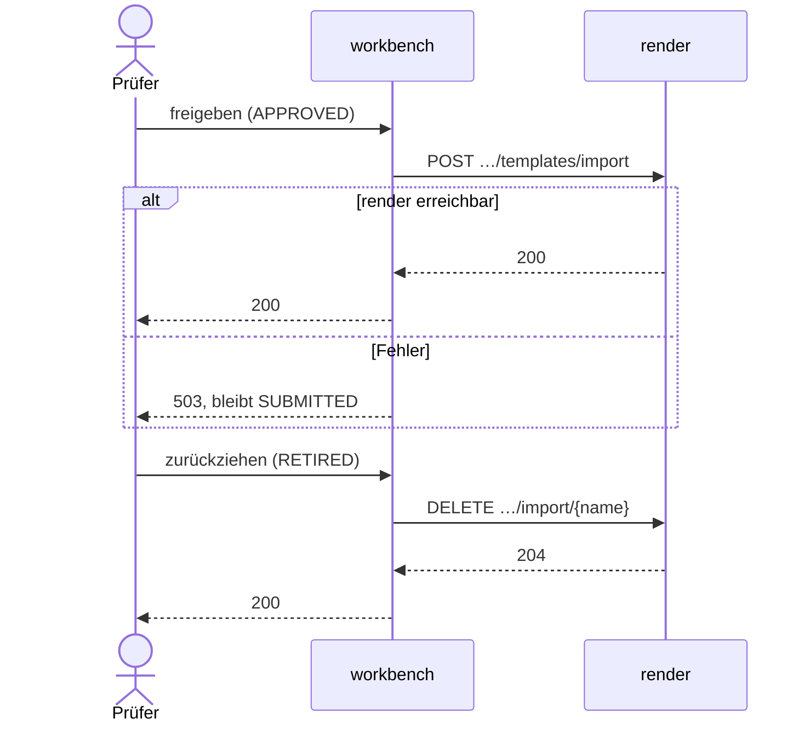

# Freigabe, Deploy und Zurückziehen

Eine Vorlage wird eingereicht, vom Prüfer abgelehnt oder freigegeben und später
zurückgezogen. Bei der Freigabe kopiert die Workbench die Vorlage per REST nach `production`;
eine gemeinsame Datenbank gibt es nicht ([US-0017](../01-goals/stories/US-0017.md)). Die
Status und erlaubten Übergänge stehen im [Domänenmodell](../08-concepts/domaenenmodell.md).

## Einreichen und Ablehnen

1. **Einreichen:** `POST /api/workbench/templates/{id}/submit` verlangt `DRAFT` und eine
   gültige Vorlage, setzt `SUBMITTED` und löscht Ablehnungsgrund und -zeitpunkt. Nach
   `production` geht nichts ([REQ-0024](../01-goals/requirements/REQ-0024.md)).
2. **Ablehnen:** `POST …/{id}/reject` verlangt `SUBMITTED`, setzt die Vorlage auf `DRAFT` und
   speichert Begründung und Zeitpunkt. Nach `production` geht nichts
   ([REQ-0013](../01-goals/requirements/REQ-0013.md)). Die Oberfläche zeigt die Begründung
   beim Entwurf an.
3. Der Gestalter korrigiert die Vorlage und reicht sie erneut ein.

Die Workbench-Oberfläche hat zwei Wege zum Einreichen: die Detailansicht ruft `…/submit` auf,
der Knopf „→ Test“ im Dashboard dagegen den allgemeinen Statuswechsel
`PUT …/{id}/status`. Dieser prüft nur, ob der Übergang erlaubt ist, nicht die Gültigkeit der
Vorlage, und lässt einen früheren Ablehnungsgrund stehen.

_(confidence: verified — blocpress-workbench/…/TemplateResource.java (`submitForApproval`,
`reject`, `updateStatus`, `isValidTransition`),
blocpress-workbench/src/main/resources/META-INF/resources/components/bp-workbench.js
(`_changeStatus`, Aufruf von `…/submit`); derived_from:
arc42.adoc:1162-1172 legacy (git history), arc42.adoc:1272-1310 legacy (git history))_

## Freigeben und Deploy

1. Der Prüfer gibt im Freigabedialog Gültigkeitsbeginn und optional einen Review-Zyklus an.
   `PUT …/{id}/status` mit `APPROVED` setzt `validFrom` (Tagesbeginn des Datums, ohne Datum
   bleibt der bisherige Wert), `reviewCycleYears` und `validUntil = validFrom + Zyklus`
   ([REQ-0020](../01-goals/requirements/REQ-0020.md)).
2. Die Workbench aktualisiert den Status im Suchindex und schickt dann `id`, `name`,
   `version`, den Inhalt als Base64, `validFrom` und `validUntil` an
   `POST /api/render/templates/import` ([REQ-0014](../01-goals/requirements/REQ-0014.md)).
3. render (`TemplateImportResource`) prüft die Pflichtfelder (sonst 400), löscht einen Eintrag
   mit derselben `id`, legt den neuen an und leert den ganzen Vorlagen-Cache. Ältere Versionen
   desselben Namens bleiben stehen.
4. Ist render nicht erreichbar oder antwortet mit einem Fehler, antwortet die Workbench mit
   503. Die Transaktion wird zurückgerollt, die Vorlage bleibt `SUBMITTED`
   ([REQ-0015](../01-goals/requirements/REQ-0015.md)).

Der Import-Endpunkt ist ohne Anmeldung erreichbar, auch wenn JWT für render eingeschaltet ist.
Die Workbench ruft ihn mit einem eigenen `HttpClient` auf.

_(confidence: verified — TemplateResource.java (`updateStatus`), TemplateImportResource.java,
blocpress-render/src/main/resources/application.properties
(`permission.internal`); derived_from: arc42.adoc:1222-1260 legacy (git history))_

Scheitert der Deploy, ist der Status im Suchindex schon auf `APPROVED` gesetzt; die
Datenbank-Transaktion wird zurückgerollt, der Index nicht. Suche und Workbench zeigen dann
verschiedene Status.

_(confidence: verified — TemplateResource.java (`updateStatus`: `elasticsearchIndexService.updateStatus`
vor dem Deploy), ElasticsearchIndexService.java (`updateStatus`))_

## Zurückziehen

1. `PUT …/{id}/status` mit `RETIRED` (nur aus `APPROVED`) setzt `validUntil` auf jetzt,
   entfernt die Vorlage aus dem Suchindex und ruft `DELETE /api/render/templates/import/{name}`
   ([REQ-0023](../01-goals/requirements/REQ-0023.md)).
2. render löscht **alle** Einträge mit diesem Namen aus `production`, also auch andere
   freigegebene Versionen, und entfernt den Namen aus dem Cache. Danach liefert
   [Rendern per Name](render-by-name.md) 404.

Anders als bei der Freigabe werden Fehler beim Zurückziehen nur geloggt: Ist render nicht
erreichbar, steht die Vorlage in der Workbench auf `RETIRED`, bleibt aber in `production`
renderbar. Der Name wird ungeprüft an die URL gehängt; enthält er Zeichen, die in einer URI
nicht erlaubt sind (etwa ein Leerzeichen), scheitert schon der Aufbau der Anfrage, mit
derselben Folge.

_(confidence: verified — TemplateResource.java (`updateStatus`, `removeFromProduction`),
TemplateImportResource.java (`removeTemplate`); derived_from:
arc42.adoc:1261-1269 legacy (git history))_

Ein Wechsel von `APPROVED` zurück nach `SUBMITTED` ruft render nicht auf; die Vorlage bleibt
in `production` gültig. Entschieden (2026-10-06): Der Wechsel wird verboten; eine
freigegebene Version wird nicht zurückgestuft. Änderungen laufen über einen neuen Entwurf,
das Zurückziehen über `RETIRED` ([US-0042](../01-goals/stories/US-0042.md)).

_(confidence: verified — TemplateResource.java (`updateStatus`, `isValidTransition`))_

Gegenüber dem Altbestand korrigiert: `validFrom` wird bei der Freigabe nicht auf „jetzt“
gesetzt. Der Import ist kein Upsert nach Namen, sondern nach `id`. Beim Zurückziehen
löscht render nicht die eine Vorlage, sondern alle Einträge des Namens. Das erneute Einreichen
über `PUT …/status` löscht den Ablehnungsgrund nicht, nur `POST …/submit` tut das. Die
Ablehnung prüft der Endpunkt selbst, eine Rollenprüfung gibt es nicht
([US-0021](../01-goals/stories/US-0021.md)).

- UNKNOWN — offene Frage: Soll das Zurückziehen wie die Freigabe fehlschlagen (503), wenn render die Vorlage nicht entfernen kann, und soll es nur die zurückgezogene Version statt aller Versionen des Namens entfernen?

