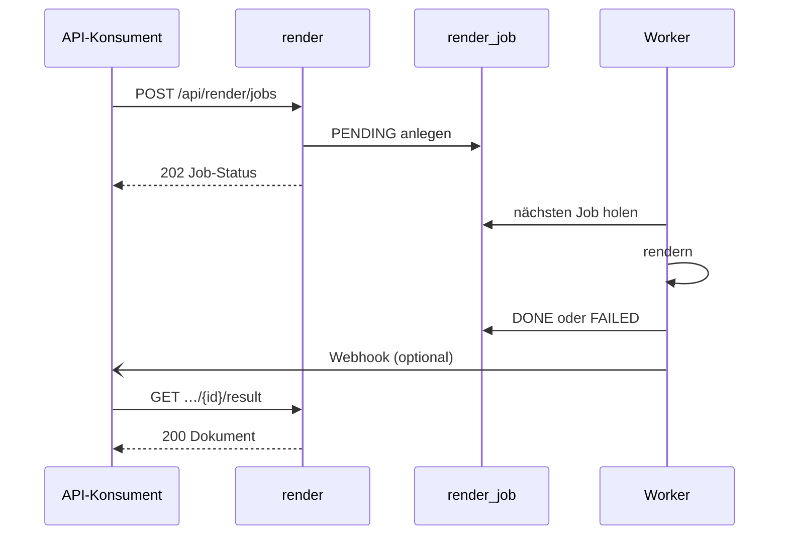

# Asynchroner Render-Auftrag

Ein Anwendungssystem gibt einen Auftrag ab, ohne auf das Dokument zu warten, und holt das
Ergebnis später ab oder lässt sich per Webhook benachrichtigen. Die Warteschlange ist die
Tabelle `render_job` in `production` ([ADR-0012](../09-decisions/ADR-0012.md)).

1. `AsyncRenderResource.submitJob` prüft nur, dass `templateName` und `data` vorhanden sind
   (sonst 400), legt einen `RenderJob` mit `PENDING` an und antwortet mit 202 und dem
   Job-Status. Ob die Vorlage existiert, wird hier nicht geprüft. Ohne `outputType` gilt `pdf`.
2. `RenderJobWorker.dispatch` läuft alle `BLOCPRESS_ASYNC_POLL_INTERVAL` (Standard 2 s) und
   startet so viele Verarbeitungsschleifen, wie es Worker gibt
   ([REQ-0027](../01-goals/requirements/REQ-0027.md)).
3. Jede Schleife holt mit `RenderJob.claimNextPending` den ältesten wartenden Job und setzt ihn
   in derselben Anweisung auf `PROCESSING` (`UPDATE … WHERE id = (SELECT … FOR UPDATE SKIP
   LOCKED)`), jeweils in einer eigenen Transaktion. Sie arbeitet, bis kein Job mehr wartet.
4. Gerendert wird außerhalb einer Transaktion, mit derselben Vorlagensuche und demselben Cache
   wie beim [Rendern per Name](render-by-name.md). Ein unbekannter `outputType` ergibt ODT.
5. Das Ergebnis oder die Fehlermeldung wird in einer neuen Transaktion gespeichert, Status
   `DONE` oder `FAILED`. Eine unbekannte oder abgelaufene Vorlage endet als `FAILED`.
6. Ist eine `webhookUrl` angegeben, schickt `WebhookSender` in einem virtuellen Thread
   `{"jobId": …, "status": …}` per POST, bei `DONE` und bei `FAILED`. Es gibt keine
   Wiederholung; Fehler werden nur geloggt.
7. `GET /api/render/jobs/{id}` liefert den Status, bei `DONE` mit `resultUrl`.
   `GET …/{id}/result` liefert das Dokument, vor `DONE` 409, für eine unbekannte ID 404.

_(confidence: verified — blocpress-render/…/AsyncRenderResource.java, RenderJobWorker.java
(`dispatch`, `drainQueue`, `process`, `finish`), RenderJob.java (`claimNextPending`),
WebhookSender.java, application.properties; derived_from:
arc42.adoc:1009-1081 legacy (git history))_

**Hintergrundläufe.**

- Minütlich setzt `requeueStaleJobs` Jobs, die länger als `BLOCPRESS_ASYNC_STALE_AFTER`
  (Standard 10 Minuten) in `PROCESSING` stehen, zurück auf `PENDING`, etwa nach dem Absturz
  einer Instanz. Ein Job, der nur länger als diese Zeit rendert, wird damit ein zweites Mal
  verarbeitet.
- Stündlich löscht `cleanupJobs` die Ergebnis-Bytes nach `BLOCPRESS_ASYNC_RESULT_RETENTION`
  (Standard 24 Stunden) und den Datensatz nach `BLOCPRESS_ASYNC_RECORD_RETENTION` (Standard
  7 Tage). Das betrifft auch die Protokolleinträge synchroner Aufrufe.

_(confidence: verified — RenderJobWorker.java (`requeueStaleJobs`, `cleanupJobs`),
application.properties; derived_from: arc42.adoc:2388-2422 legacy (git history))_

Nach dem Löschen der Ergebnis-Bytes bleibt der Status `DONE` und `resultUrl` gesetzt;
`getJobResult` gibt dann eine Antwort ohne Inhalt zurück statt eines Fehlers.

_(confidence: verified — AsyncRenderResource.java (`getJobResult`, `toStatus`),
RenderJobWorker.java (`cleanupJobs`))_

Gegenüber dem Altbestand korrigiert: Der Worker holt nicht einen Job je Takt, sondern startet
mehrere Schleifen, die die Warteschlange leeren. Der Webhook geht auch bei `FAILED` hinaus.
Die Konvertierung läuft über `LibreOfficePool.convert`.

Der Ergebnisabruf antwortet dann mit 204 (`Response.ok(null)`). Entschieden (2026-10-06):
Er soll stattdessen 410 Gone melden; umgesetzt wird das in
[US-0045](../01-goals/stories/US-0045.md).
