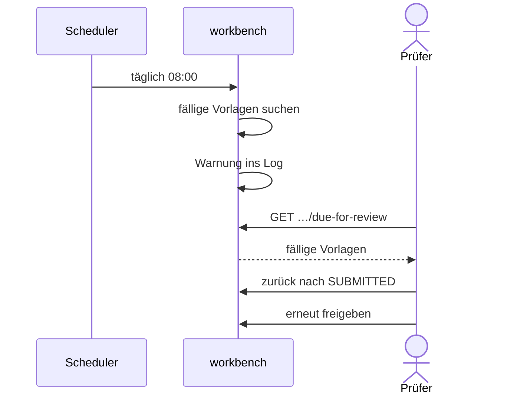

# Compliance-Überwachung

Freigegebene Vorlagen mit Review-Zyklus haben ein Ablaufdatum. Die Workbench zeigt, welche
bald ablaufen; danach rendert render sie nicht mehr. Eine aktive Benachrichtigung gibt es
nicht, sie ist als [US-0040](../01-goals/stories/US-0040.md) offen.

1. **Ablaufdatum setzen:** Bei der Freigabe mit Review-Zyklus von N Jahren setzt die
   Workbench `validUntil = validFrom + N Jahre` und gibt es mit dem Import an render weiter
   ([REQ-0020](../01-goals/requirements/REQ-0020.md), siehe
   [Freigabe](approval-and-deployment.md)). Ohne Zyklus bleibt `validUntil` leer und die
   Vorlage läuft nie ab.
2. **Prüflauf:** `ComplianceReviewScheduler.checkDueForReview` läuft täglich um 08:00 und
   sucht alle Vorlagen mit Status `APPROVED`, deren `validUntil` vor jetzt plus
   `BLOCPRESS_COMPLIANCE_LEAD_DAYS` (Standard 60 Tage) liegt. Findet er welche, schreibt er
   eine Warnung mit Anzahl und Namen ins Log. Mehr tut er nicht.
3. **Abruf:** `GET /api/workbench/templates/due-for-review` liefert dieselbe Auswahl
   ([REQ-0021](../01-goals/requirements/REQ-0021.md)). Die Oberfläche lädt sie, markiert den
   Filter „Produktiv“. Die Kennzeichnung „Läuft ab“ oder „Abgelaufen“ an den Vorlagen ist
   zwar programmiert, wird aber nie angezeigt (siehe [Dashboard](dashboard.md),
   [US-0048](../01-goals/stories/US-0048.md)).
4. **Erneut freigeben:** Weder `APPROVED → APPROVED` noch die Rückstufung nach `SUBMITTED`
   ist erlaubt ([REQ-0062](../01-goals/requirements/REQ-0062.md)). Über „Als Kopie“ oder
   `…/new-draft` entsteht eine neue Version, die eingereicht und mit neuem Gültigkeitsbeginn
   und Zyklus freigegeben wird.
5. **Ablauf:** Ist `validUntil` überschritten, findet render die Version nicht mehr und
   antwortet beim [Rendern per Name](render-by-name.md) mit 404
   ([REQ-0022](../01-goals/requirements/REQ-0022.md)), sofort und auf allen Instanzen
   ([REQ-0038](../01-goals/requirements/REQ-0038.md)). In der Workbench bleibt die Vorlage `APPROVED`.

Bereits abgelaufene Vorlagen erfüllen die Bedingung weiter und erscheinen täglich erneut in
Log und Liste, bis sie neu freigegeben oder zurückgezogen sind.

_(confidence: verified — blocpress-workbench/…/service/ComplianceReviewScheduler.java,
TemplateResource.java (`updateStatus`, `getDueForReview`, `isValidTransition`,
`createNewDraft`), blocpress-workbench/src/main/resources/application.properties
(`blocpress.compliance.review-lead-days`), bp-workbench.js (`_loadDueForReview`,
`_renderFilterButtons`), blocpress-render/…/ProductionTemplate.java
(`findLatestActiveByName`); derived_from: arc42.adoc:1312-1344 legacy (git history))_

Gegenüber dem Altbestand korrigiert: Der Prüfer liest die fällige Liste über die Workbench,
nicht direkt aus dem Repository. „Neu freigeben“ ist kein eigener Schritt, sondern der Weg
über `SUBMITTED`. Der Altbestand nennt `TF-7` als „Compliance-Reviews überwachen“; tatsächlich
wird nur geloggt.

Entschieden (2026-10-06): Eine abgelaufene Vorlage bleibt in der Workbench `APPROVED`; der
Ablauf ist ein Datum, kein Status. render sperrt sie ([US-0041](../01-goals/stories/US-0041.md)),
das Dashboard kennzeichnet sie ([US-0048](../01-goals/stories/US-0048.md)).
