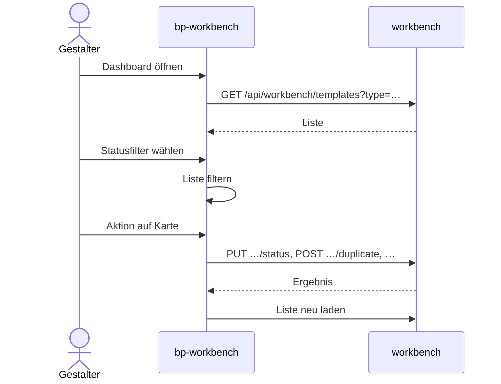

# Vorlagen-Dashboard

Die Startseite der Workbench-Oberfläche (`bp-workbench`) listet die Vorlagen oder Bausteine,
filtert sie nach Status und bietet je Status die passenden Aktionen an. Gefiltert wird im
Browser; die Workbench liefert nur die Liste und führt die Aktionen aus.

## Liste und Filter

1. Beim Start und nach jeder Aktion lädt die Oberfläche
   `GET /api/workbench/templates?type=TEMPLATE` oder `…=BAUSTEIN`, je nach Reiter; ohne
   `type` gilt `TEMPLATE`. Ein Wechsel des Reiters setzt den Filter auf „Alle“ zurück.
2. `TemplateResource.list` liefert je Name höchstens zwei Einträge, nach Name sortiert: die
   höchste Version, die nicht `APPROVED` ist, und die höchste Version mit `APPROVED`. Ältere
   Versionen erscheinen nicht. Jeder Eintrag enthält `id`, `name`, `createdAt`, `status`,
   `isValid`, `type` und `version`.
3. Die Filterknöpfe „Alle“, „Entwurf“, „Test“, „Produktiv“, „Abgelehnt“ und „Zurückgezogen“
   zeigen die Anzahl der Einträge je Status und filtern die geladene Liste ohne neuen Aufruf.
   Gibt es zur Prüfung fällige Vorlagen, trägt „Produktiv“ ein Warnzeichen (siehe
   [Compliance-Überwachung](compliance-review.md)).
4. Die gefilterten Einträge werden je Name zu einer Karte zusammengefasst, mit Abzeichen
   „vN Produktiv“ und „vN Status“, Erstellungsdatum und „Valid“ oder „Invalid“.
5. Über der Liste liegt die Volltextsuche (ab zwei Zeichen, `GET /api/workbench/search`); sie
   ersetzt die Liste durch Treffer aus dem Suchindex.

_(confidence: verified — blocpress-workbench/…/TemplateResource.java (`list`, `toSummary`,
`TemplateSummary`), bp-workbench.js (`_loadTemplates`, `_switchActiveType`,
`_renderDashboard`, `_renderFilterButtons`, `_filterTemplates`, `_groupTemplatesByName`,
`_renderTemplateGroup`, `_executeEsSearch`), SearchResource.java (`search`); derived_from:
arc42.adoc:1131-1161 legacy (git history))_

Die Aktionen einer Karte gehören zur Version in Arbeit, nur ohne sie zur produktiven Version;
diese lässt sich dann über „vN ansehen“ öffnen. Gibt es zu einem Namen beide, erscheinen
„Zurückziehen“ und „Als Kopie“ der produktiven Version erst unter dem Filter „Produktiv“, der
die andere Version ausblendet.

_(confidence: verified — bp-workbench.js (`_renderTemplateGroup`: `primary = inProgress ||
approved`))_

Die Abzeichen „Läuft ab“ und „Abgelaufen“ erscheinen im Dashboard nicht: Die Funktion, die
sie erzeugt, wird nur von einer nicht verwendeten Kartenansicht aufgerufen, und die Liste
enthält kein `validUntil`.

_(confidence: verified — bp-workbench.js (`_getComplianceBadge` nur in `_renderTemplateCard`,
das nirgends aufgerufen wird), TemplateResource.java (`TemplateSummary` ohne `validUntil`))_

## Aktionen je Status

Alle Karten haben „Öffnen“. Dazu kommen:

| Status | Aktionen |
|---|---|
| `DRAFT` | Aktualisieren, → Test, Löschen |
| `SUBMITTED` | ← Zurück, ✓ Genehmigen, ✗ Ablehnen |
| `APPROVED` | ← Zurück zu Test, Als Kopie, Zurückziehen |
| `REJECTED` | ← Zurück, Löschen |
| `RETIRED` | Als Kopie |

Die Statuswechsel („→ Test“, „← Zurück“, Genehmigen, Ablehnen, Zurückziehen) laufen über
`PUT …/{id}/status` beziehungsweise `POST …/{id}/reject` und sind in
[Freigabe, Deploy und Zurückziehen](approval-and-deployment.md) beschrieben. Nach jeder Aktion
zeigt die Oberfläche eine Erfolgs- oder Fehlermeldung und lädt die Liste neu.

_(confidence: verified — bp-workbench.js (`_getTemplateActions`, `_changeStatus`))_

1. **Als Kopie:** Die Oberfläche fragt nach einem Namen (Vorschlag „Name (Kopie)“) und ruft
   `POST …/{id}/duplicate` mit `{name}`. Bei gleichem Namen wird die Version hochgezählt; bei
   einem anderen Namen antwortet die Workbench mit 409, wenn es ihn schon gibt. Die Kopie
   wird neu geprüft und als `DRAFT` gespeichert; die Antwort ist 201.
2. **Aktualisieren:** Die Oberfläche öffnet einen Dateidialog und schickt die neue ODT-Datei
   an `PUT …/{id}/content`. Nur im Status `DRAFT` erlaubt (sonst 400); Inhalt und
   Prüfergebnis werden ersetzt, Version und Erstellungsdatum bleiben. Die Antwort enthält
   `isValid`, `errors` und `warnings` (zur Prüfung siehe
   [Vorlage hochladen und validieren](upload-and-validate.md)).
3. **Löschen:** Nach einer Rückfrage ruft die Oberfläche `DELETE …/{id}`. Die Workbench
   entfernt den Eintrag aus dem Suchindex und löscht die Vorlage samt Testdaten; Antwort 204.

_(confidence: verified — TemplateResource.java (`duplicate`, `updateContent`, `delete`),
bp-workbench.js (`_duplicateTemplate`, `_updateTemplate`, `_deleteTemplate`); derived_from:
arc42.adoc:1174-1220 legacy (git history))_

**Auffälligkeiten im Code.**

- `duplicate` übernimmt den Typ nicht: Die Kopie eines Bausteins wird als `TEMPLATE`
  gespeichert. Die Namensprüfung und die Versionssuche beachten den Typ ebenfalls nicht.
- `duplicate` prüft den Status der Quelle nicht; dass nur `APPROVED` und `RETIRED` kopiert
  werden, regelt allein die Oberfläche. Fehlt `name` im Aufruf, bricht der Endpunkt mit einer
  unbehandelten Ausnahme ab.
- `DELETE …/{id}` prüft den Status nicht und ruft render nicht auf. Über die API lässt sich
  so eine freigegebene Vorlage in der Workbench löschen, während sie in `production`
  renderbar bleibt.
- Der Filter „Abgelehnt“ bleibt in der Regel leer: Die Ablehnung aus der Oberfläche setzt die
  Vorlage auf `DRAFT` zurück; `REJECTED` entsteht nur über `PUT …/status` direkt.

_(confidence: verified — TemplateResource.java (`duplicate`, `delete`, `reject`,
`isValidTransition`), entity/Template.java (`type` mit Vorgabe `TEMPLATE`))_

Gegenüber dem Altbestand korrigiert: Es gibt keinen `TemplateService`; die Logik liegt in
`TemplateResource`. Die Liste enthält nicht alle Vorlagen, sondern je Name die neueste Version
in Arbeit und die neueste produktive. Die Kopie prüft den Namen nur, wenn er sich vom
Quellnamen unterscheidet. Benutzer- und Rechteverwaltung gibt es nicht
([US-0021](../01-goals/stories/US-0021.md)).

- UNKNOWN — offene Frage: Sollen ältere Versionen eines Namens im Dashboard sichtbar sein, und sollen die Aktionen der produktiven Version auch erreichbar sein, wenn eine neuere Version in Arbeit ist?
Entschieden (2026-10-06): Auch das Backend soll das Löschen auf `DRAFT` und `REJECTED`
beschränken und sonst mit 409 antworten; umgesetzt wird das in
[US-0048](../01-goals/stories/US-0048.md).
