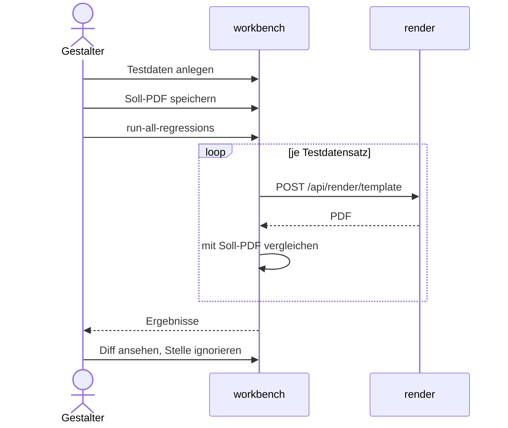

# Testdaten und Regressionstest

Der Gestalter hinterlegt zu einer Vorlage Testdaten und ein erwartetes PDF und prüft nach
einer Änderung, ob die Vorlage noch dasselbe Dokument erzeugt. Alles läuft synchron in der
Workbench; gerendert wird über render, gespeichert in der Datenbank `workbench`.

## Testdaten und Soll-PDF

1. `POST /api/workbench/templates/{id}/testdata` legt einen Testdatensatz mit Namen und
   JSON-Daten an. Das Eingabeformular in der Oberfläche entsteht aus dem JSON-Schema im
   Validierungsergebnis der Vorlage; Vorschläge aus der Abdeckungsanalyse lassen sich über
   `…/testdata/from-suggestion` übernehmen.
2. Die Vorschau (`POST …/{id}/preview`) schickt Vorlage und Testdaten an
   `POST /api/render/template` und gibt das PDF an den Browser.
3. `POST …/testdata/{tdsId}/save-expected` speichert dieses PDF als Soll-PDF
   (`expectedPdf`) samt SHA-256-Hash am Testdatensatz.
   `POST …/testdata/{tdsId}/save-rendered-as-expected` rendert stattdessen in der Workbench
   neu und speichert das Ergebnis; die Oberfläche nutzt das, um eine Abweichung als neuen
   Sollstand zu übernehmen.

_(confidence: verified — blocpress-workbench/…/TemplateResource.java (`createTestDataSet`,
`createFromSuggestion`, `previewTemplate`, `saveExpectedPdf`, `saveRenderedAsExpected`),
TestDataSetService.java (`saveExpectedPdf`), bp-workbench.js (`_finalizePdfSave`,
`_saveCurrentDiffAsExpected`, Testdaten-Formular aus `validationResult.schema`); derived_from: arc42.adoc:843-910 legacy (git history))_

## Regressionslauf

1. `POST …/{id}/run-all-regressions` ruft für jeden Testdatensatz nacheinander
   `runRegression` auf ([REQ-0019](../01-goals/requirements/REQ-0019.md)).
2. Ohne Soll-PDF lautet das Ergebnis „kein Soll-PDF“, nicht „fehlgeschlagen“
   ([REQ-0017](../01-goals/requirements/REQ-0017.md)).
3. Sonst rendert die Workbench das aktuelle PDF über render und vergleicht es mit
   `PdfComparisonService.areVisuallyIdentical`, einmal ohne und einmal mit den
   Ignoriermustern (die der Vorlage plus die des Testdatensatzes).
4. Identisch ohne Muster heißt bestanden; nur mit Mustern identisch heißt bestanden mit
   akzeptierten Abweichungen; sonst fehlgeschlagen
   ([REQ-0016](../01-goals/requirements/REQ-0016.md),
   [REQ-0018](../01-goals/requirements/REQ-0018.md)). Ein Fehler beim Rendern erscheint als
   fehlgeschlagenes Ergebnis mit Meldung.

Die Ergebnisse werden nur zurückgegeben, nicht gespeichert.

**Vergleich.** `PdfComparisonService` vergleicht Text, nicht Pixel. Sind die Bytes gleich und
keine Muster gesetzt, gilt das PDF sofort als identisch. Sonst zieht `pdftohtml -xml` jede
Textzeile mit Position heraus; verschiedene Seitenzahl ist eine Abweichung, auf jeder Seite
gilt eine Zeile als abweichend, die auf derselben Seite des anderen PDFs nicht vorkommt.
Zeilen, auf die ein Muster passt, fallen heraus: reguläre Ausdrücke (ungültige werden wörtlich
genommen) für Text, `@area:{seite}:{x1}:{y1}:{x2}:{y2}` für eine Fläche. Scheitert die
Textextraktion, fällt der Vergleich auf Byte-Gleichheit zurück.

_(confidence: verified — TemplateResource.java (`runAllRegressions`, `runRegression`,
`mergedIgnoredPatterns`, `renderPdf`), PdfComparisonService.java (`areVisuallyIdentical`,
`diffPages`, `parseAreaIgnores`, `compilePatterns`); derived_from:
arc42.adoc:911-935 legacy (git history))_

## Abweichungen ansehen und ignorieren

1. `POST …/testdata/{tdsId}/regression-diff-pages` rendert erneut und liefert je Seite beide
   Seitenbilder (`pdftoppm`, 150 dpi) und die abweichenden Textblöcke mit Koordinaten. Die
   Oberfläche zeigt sie als klickbare Markierungen.
2. Ein Klick auf einen Block bietet zwei Wege über `POST …/testdata/{tdsId}/ignore-block`:
   „nur diese Stelle“ speichert ein `@area:`-Muster am Testdatensatz, „überall“ ein
   Textmuster an der Vorlage, das für alle Testdatensätze gilt.
3. `POST …/testdata/{tdsId}/regression-diff` erzeugt alternativ ein PDF mit beiden Fassungen
   nebeneinander und rot markierten Abweichungen; die Oberfläche ruft diesen Endpunkt nicht auf.

_(confidence: verified — TemplateResource.java (`regressionDiffPages`, `ignoreBlock`,
`regressionDiff`), PdfComparisonService.java (`generateDiffPages`, `generateDiffPdf`),
bp-workbench.js (`_applyIgnore`); derived_from: arc42.adoc:911-935 legacy (git history))_

`save-expected` prüft, dass die Vorlage existiert, aber nicht, dass der Testdatensatz zu ihr
gehört; die übrigen Testdaten-Endpunkte prüfen das.

_(confidence: verified — TemplateResource.java (`saveExpectedPdf` gegenüber `runRegression`))_

Gegenüber dem Altbestand korrigiert: Es gibt keinen `StorageService`; das Soll-PDF liegt als
`bytea` am Testdatensatz. Die Vorschau ruft render nicht direkt aus dem Browser auf, sondern
über die Workbench. Den automatischen Regressionstest im Modul `blocpress-proof` mit Message
Queue, TestWorker und gespeichertem Teststatus (Altbestand 1083–1129) gibt es nicht
([ADR-0003](../09-decisions/ADR-0003.md)); Regressionstests startet der Gestalter von Hand,
und die Freigabe hängt nicht von ihrem Ergebnis ab.

_(confidence: verified — TemplateResource.java (`updateStatus` ohne Prüfung von
Regressionsergebnissen), TestDataSet.java; derived_from:
arc42.adoc:1083-1129 legacy (git history))_

Entschieden (2026-10-06): Die Freigabe soll voraussetzen, dass alle Regressionstests
bestanden sind; die Ergebnisse werden nicht gespeichert
([US-0050](../01-goals/stories/US-0050.md)).
