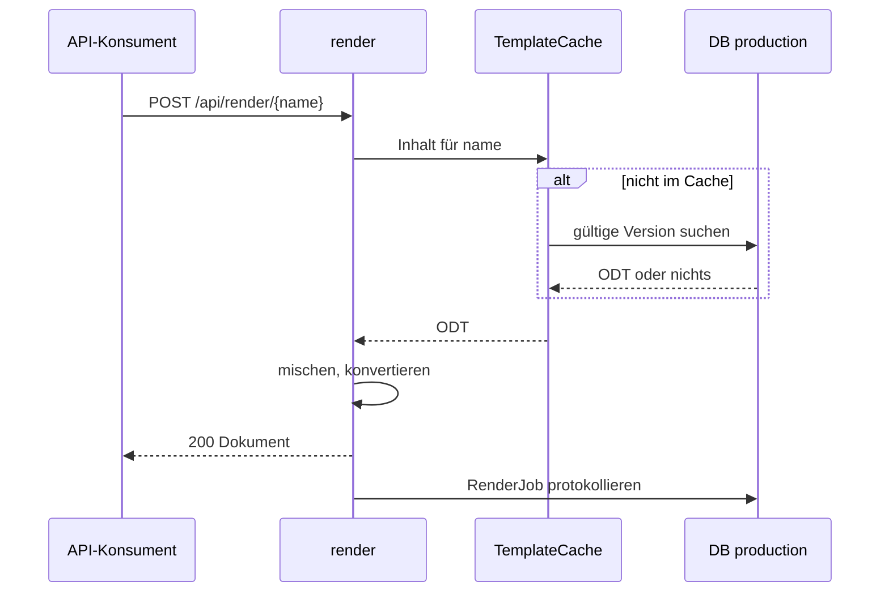

# Rendern per Name mit Cache

Ein Anwendungssystem erzeugt ein Dokument aus einer freigegebenen Vorlage, die es nur über
ihren Namen kennt. render wählt die gültige Version selbst und liest dabei nur die eigene
Datenbank `production`, nie die Workbench.

1. Der Aufruf bringt die JSON-Daten und `outputType` (`pdf`, `rtf` oder `odt`) mit.
2. `TemplateCache.getTemplateContentByName` liefert den Inhalt aus dem Cache (Caffeine,
   höchstens 100 Einträge, 10 Minuten nach dem Schreiben verfallen). Fehlt der Eintrag,
   sucht `ProductionTemplate.findLatestActiveByName` unter allen Einträgen des Namens mit
   `validFrom ≤ jetzt` und (`validUntil` leer oder `> jetzt`) den mit dem jüngsten `validFrom`,
   bei Gleichstand die höchste Version (siehe [Versionierung](../08-concepts/versionierung.md)).
3. Findet sich keine gültige Version, auch weil das Ablaufdatum überschritten ist, antwortet
   render mit 404 ([REQ-0022](../01-goals/requirements/REQ-0022.md)).
4. `RenderEngine.mergeTemplate` mischt Vorlage und Daten mit der eingestellten Standard-Locale,
   `LibreOfficePool.convert` erzeugt das Zielformat (siehe
   [blocpress-core](../05-building-blocks/core.md)). Gleichzeitige Konvertierungen begrenzt
   ein Semaphor auf `BLOCPRESS_LO_WORKERS` (Standard 2), gemeinsam mit den asynchronen Aufträgen.
5. Jeder Aufruf, erfolgreich oder nicht, wird in einer eigenen Transaktion als `RenderJob`
   mit Status `DONE` oder `FAILED` festgehalten, ohne Ergebnis-Bytes. Ein Fehler dabei
   ändert die Antwort nicht.

Fehler im Mischen oder Konvertieren beantwortet render mit 500 und der Fehlermeldung.

_(confidence: verified — blocpress-render/…/RenderResource.java (`renderDocumentByName`,
`mergeAndTransform`), TemplateCache.java, ProductionTemplate.java (`findLatestActiveByName`),
LibreOfficePool.java, RenderJobWorker.java (`recordSync`),
blocpress-render/src/main/resources/application.properties; derived_from:
docs/legacy/specification/arc42.adoc:938-1007)_

**Folgen des Caches.** Der Cache kennt das Ablaufdatum nicht: Eine Version, deren
`validUntil` verstreicht oder deren Nachfolger durch Zeitablauf gültig wird, kann noch bis zu
10 Minuten aus dem Cache ausgeliefert werden. Ein Import leert den Cache ganz, das
Zurückziehen nur den Eintrag des Namens (siehe [Freigabe](approval-and-deployment.md)). Der Cache
liegt im Speicher jeder render-Instanz; Import und Zurückziehen leeren ihn nur in der
Instanz, die den Aufruf erhält.

_(confidence: verified — TemplateCache.java (`@CacheResult`, `invalidate`),
TemplateImportResource.java (`@CacheInvalidateAll`, `removeTemplate`),
`quarkus.cache.type=caffeine`)_

In `renderDocumentByName` gibt es einen Zweig, der bei der Meldung „not approved“ mit 403
antwortet. `TemplateCache` erzeugt diese Meldung nie; der Zweig wird nicht erreicht.

_(confidence: verified — RenderResource.java, TemplateCache.java)_

Gegenüber dem Altbestand korrigiert: render wählt nicht die „höchste Version mit
`validFrom ≤ now`“, sondern zuerst nach `validFrom` und beachtet `validUntil`. Der Ablauf ist
nicht `TemplateNotFoundException` vom Repository, sondern ein leeres Suchergebnis. Konvertiert
wird über `LibreOfficePool.convert`, nicht `refreshAndTransform`. Neu gegenüber dem Altbestand
ist der Protokolleintrag als `RenderJob`.

- UNKNOWN — offene Frage: Soll ein abgelaufenes oder zurückgezogenes Template bis zu 10 Minuten (und in weiteren render-Instanzen) noch gerendert werden dürfen, oder muss der Cache das Ablaufdatum beachten?
