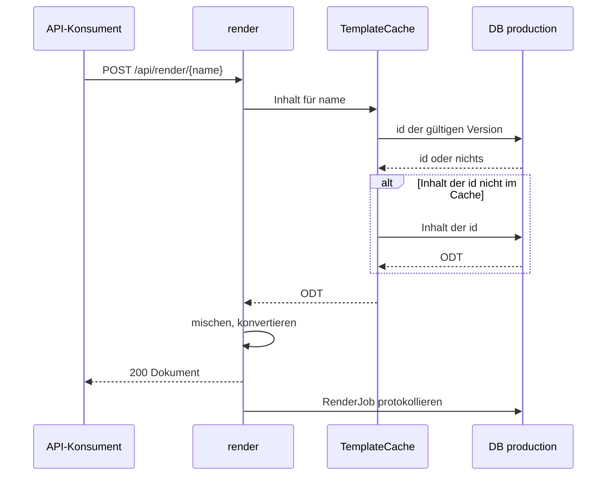

# Rendern per Name mit Cache

Ein Anwendungssystem erzeugt ein Dokument aus einer freigegebenen Vorlage, die es nur über
ihren Namen kennt. render wählt die gültige Version selbst und liest dabei nur die eigene
Datenbank `production`, nie die Workbench.

1. Der Aufruf bringt die JSON-Daten und `outputType` (`pdf`, `rtf` oder `odt`) mit.
2. `TemplateCache.getTemplateContentByName` sucht bei jedem Aufruf mit
   `ProductionTemplate.findValidId` unter allen Einträgen des Namens mit `validFrom ≤ jetzt`
   und (`validUntil` leer oder `> jetzt`) den mit dem jüngsten `validFrom`, bei Gleichstand die
   höchste Version (siehe [Versionierung](../08-concepts/versionierung.md)); „jetzt“ ist die Zeit
   der JVM. Die Abfrage liefert nur die `id`. Den Inhalt dieser `id` hält
   `TemplateContentCache` im Speicher (Caffeine, höchstens 300 Einträge, eine Stunde nach dem
   letzten Zugriff verfallen), sonst lädt er ihn aus der Datenbank.
3. Findet sich keine gültige Version, auch weil das Ablaufdatum überschritten ist, antwortet
   render mit 404 ([REQ-0022](../01-goals/requirements/REQ-0022.md)).
4. `RenderEngine.mergeTemplate` mischt Vorlage und Daten mit der eingestellten Standard-Locale,
   `LibreOfficePool.convert` erzeugt das Zielformat (siehe
   [blocpress-core](../05-building-blocks/core.md)) in einer freien warmen LibreOffice-Instanz
   ([ADR-0021](../09-decisions/ADR-0021.md)); es gibt so viele Instanzen wie Worker
   ([REQ-0027](../01-goals/requirements/REQ-0027.md), [REQ-0103](../01-goals/requirements/REQ-0103.md)),
   gemeinsam mit den asynchronen Aufträgen.
5. Jeder Aufruf, erfolgreich oder nicht, wird in einer eigenen Transaktion als `RenderJob`
   mit Status `DONE` oder `FAILED` festgehalten, ohne Ergebnis-Bytes. Ein Fehler dabei
   ändert die Antwort nicht.

Fehler im Mischen oder Konvertieren beantwortet render mit 500 und der Fehlermeldung.

_(confidence: verified — blocpress-render/…/RenderResource.java (`renderDocumentByName`,
`mergeAndTransform`), TemplateCache.java, TemplateContentCache.java, ProductionTemplate.java (`findValidId`),
LibreOfficePool.java, RenderJobWorker.java (`recordSync`),
blocpress-render/src/main/resources/application.properties; derived_from:
arc42.adoc:938-1007 legacy (git history))_

**Cache und Gültigkeit.** Weil die gültige Version bei jedem Aufruf aus der Datenbank kommt,
wirken Ablauf, Zurückziehen und neue Versionen sofort, auch wenn eine andere render-Instanz die
Änderung angenommen hat ([REQ-0063](../01-goals/requirements/REQ-0063.md),
[REQ-0038](../01-goals/requirements/REQ-0038.md)). Zwischengespeichert ist nur der Inhalt je
`id`, der sich nicht ändert; ein Import mit derselben `id` verwirft ihn. Bausteine laufen
denselben Weg (`getBausteinContentByName`).

_(confidence: verified — TemplateCache.java, TemplateContentCache.java (`@CacheResult`,
`invalidate`), TemplateImportResource.java, application.properties; ProductionChangesTest)_

Gegenüber dem Altbestand korrigiert: render wählt nicht die „höchste Version mit
`validFrom ≤ now`“, sondern zuerst nach `validFrom` und beachtet `validUntil`. Der Ablauf ist
nicht `TemplateNotFoundException` vom Repository, sondern ein leeres Suchergebnis. Konvertiert
wird über `LibreOfficePool.convert`, nicht `refreshAndTransform`. Neu gegenüber dem Altbestand
ist der Protokolleintrag als `RenderJob`.

