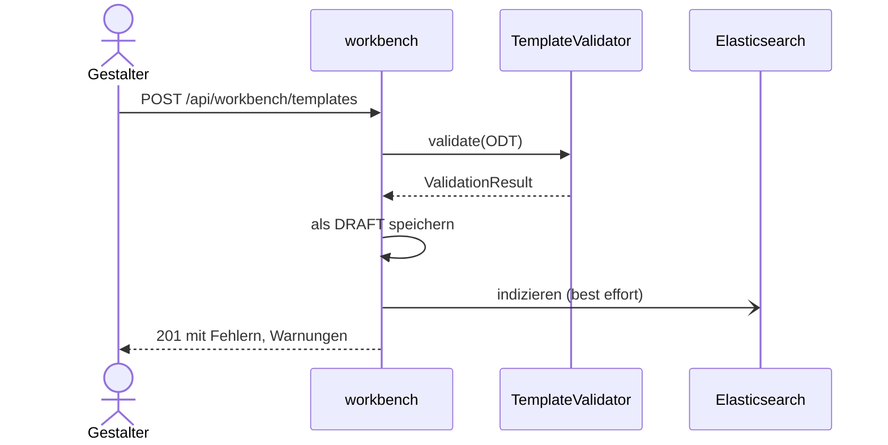

# Vorlage hochladen und validieren

Der Gestalter lädt im Dashboard der Workbench eine ODT-Datei hoch. Die Workbench prüft sie
sofort, speichert sie als neue Version im Status `DRAFT` und nimmt sie in den Suchindex auf.
Das Prüfergebnis enthält Fehler, Warnungen und ein JSON-Schema der verwendeten Felder.

## Hochladen

1. Die Oberfläche schickt `name`, `file` und `type` (`TEMPLATE` oder `BAUSTEIN`, je nach
   gewähltem Reiter) als `multipart/form-data` an `POST /api/workbench/templates`. Ein leerer
   Name ergibt 400.
2. `TemplateResource.upload` liest die Datei und ruft `TemplateValidator.validate` auf.
3. Die Version ist die höchste vorhandene Version desselben Namens und Typs plus eins, sonst 1.
   Ein vorhandener Name führt also zu einer neuen Version, nicht zu einem Fehler (siehe
   [Versionierung](../08-concepts/versionierung.md)).
4. Die Vorlage wird mit Inhalt (`bytea`, [ADR-0006](../09-decisions/ADR-0006.md)), Status
   `DRAFT` und dem Prüfergebnis in der Datenbank `workbench` gespeichert, auch wenn sie
   ungültig ist.
5. Die Antwort ist 201 mit `id`, `name`, `version`, `isValid`, `errors` und `warnings`.
6. Die Oberfläche lädt die Liste neu, öffnet die Vorlage, erzeugt aus dem Schema
   Beispieldaten und legt damit einen Testdatensatz `default` an (siehe
   [Regressionstest](regression-test.md)). Fehler und Warnungen zeigt sie nicht nach dem
   Hochladen, sondern in der Detailansicht der Vorlage.

_(confidence: verified — blocpress-workbench/…/TemplateResource.java (`upload`),
bp-workbench.js (`_onSave`, `_createDefaultTestDataAfterUpload`, `_renderDetailsView`);
derived_from: arc42.adoc:800-841 legacy (git history))_

## Prüfung

`TemplateValidator` liegt in der Workbench, nicht in core; er nutzt das Vorlagenmodell aus
[blocpress-core](../05-building-blocks/core.md) (odfdom, ohne LibreOffice).

1. Die Datei wird als ODT geladen. Gelingt das nicht, gibt es den Fehler
   `INVALID_ODT_STRUCTURE` und ein leeres Schema.
2. Die Benutzerfelder kommen aus den Felddeklarationen, ersatzweise aus den Feldverwendungen.
   Ein Name, der nicht der Punktnotation folgt, ergibt die Warnung `INVALID_FIELD_NAME` mit
   dem Feldnamen.
3. Wiederholungsgruppen werden aus der Struktur erkannt: Liegen alle Felder eines Abschnitts
   oder einer Tabellenzeile unter demselben obersten Präfix, ist dieses Präfix ein Array.
4. Jede Bedingung wird auf ihre JEXL-Syntax geprüft. Ein Syntaxfehler ergibt genau einen
   Fehler `INVALID_CONDITION`, der die Bedingung und den Fehler des Parsers nennt
   ([REQ-0026](../01-goals/requirements/REQ-0026.md)). Feldpfade aus
   Bedingungen werden in das Schema aufgenommen.
5. `JsonSchemaGenerator` baut aus Feldnamen und Arrays ein verschachteltes JSON-Schema; der
   Feldtyp folgt dem ODF-Werttyp (`number`, `boolean`, sonst `string`).
6. Gültig ist die Vorlage, wenn es keinen Fehler gibt; Warnungen ändern das nicht.

Das `ValidationResult` (Gültigkeit, Schema, Fehler, Warnungen, Bedingungen,
Wiederholungsgruppen) wird als `jsonb` an der Vorlage gespeichert. Die Oberfläche baut daraus
das Testdaten-Formular; einreichen lässt sich nur eine gültige Vorlage (siehe
[Freigabe](approval-and-deployment.md)).

_(confidence: verified — blocpress-workbench/…/service/TemplateValidator.java (`validate`),
JsonSchemaGenerator.java (`generateSchema`), entity/ValidationResult.java,
entity/Template.java (`validationResult`), TemplateResource.java (`submitForApproval`);
derived_from: arc42.adoc:800-841 legacy (git history))_

## Suchindex

Nach dem Speichern ruft die Workbench `ElasticsearchIndexService.index` auf
([ADR-0009](../09-decisions/ADR-0009.md)). `OdtTextExtractor` aus core sammelt den Text aller
Absätze; zusammen mit Name, Typ, Status, Version, den obersten Feldnamen aus dem Schema und
den Bedingungen wird er unter der Vorlagen-ID in den Index `blocpress-templates` geschrieben.
Fehler, auch ein nicht erreichbares Elasticsearch, werden nur geloggt; das Hochladen gelingt
trotzdem.

_(confidence: verified — ElasticsearchIndexService.java (`index`, `extractFieldNames`),
blocpress-core/…/odt/OdtTextExtractor.java)_

Scheitert die Textextraktion, etwa weil die Datei kein ODT ist, wird gar kein
Indexeintrag geschrieben; die Vorlage ist dann über die Suche nicht zu finden. Den Index
aktualisieren nur das Hochladen und der WebDAV-PUT ([ADR-0011](../09-decisions/ADR-0011.md)).
„Aktualisieren“ im Dashboard (`PUT …/{id}/content`), „Als Kopie“ und `…/new-draft` speichern
neue Inhalte oder Vorlagen, ohne den Index anzufassen.

_(confidence: verified — ElasticsearchIndexService.java (`index`: Extraktion im selben
`try`), TemplateResource.java (`updateContent`, `duplicate`, `createNewDraft` ohne
`index`), WebDavResource.java (PUT mit `index`))_

Ohne Datei im Formular bricht `upload` mit einer unbehandelten Ausnahme ab statt mit 400. Die
Oberfläche behandelt beim Hochladen eine Antwort 409 („existiert bereits“), die der Endpunkt
nie liefert.

_(confidence: verified — TemplateResource.java (`upload`: `file.uploadedFile()` ohne
Prüfung), bp-workbench.js (`_onSave`))_

Gegenüber dem Altbestand korrigiert: Der Endpunkt ist `POST /api/workbench/templates`, nicht
`/api/templates`. Geprüft wird mit odfdom über `TemplateValidator` in der Workbench, nicht über
die UNO-API eines `LibreOfficeProcessor`. Einen `StorageService` gibt es nicht; der Inhalt
liegt an der Vorlage. Die Antwort ist kein Template-DTO, sondern die oben genannten Felder.
Die Workbench prüft kein JWT ([Studio](../05-building-blocks/studio.md)).

- UNKNOWN — offene Frage: Sollen „Aktualisieren“, „Als Kopie“ und new-draft den Suchindex aktualisieren, und soll eine nicht lesbare Datei wenigstens mit Name und Status indiziert werden?
