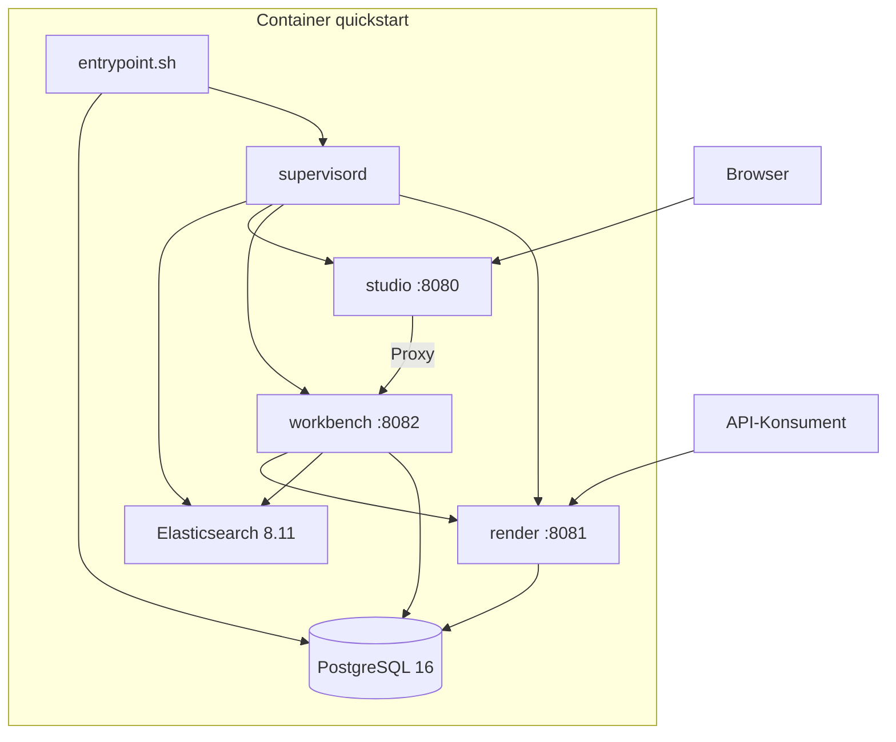
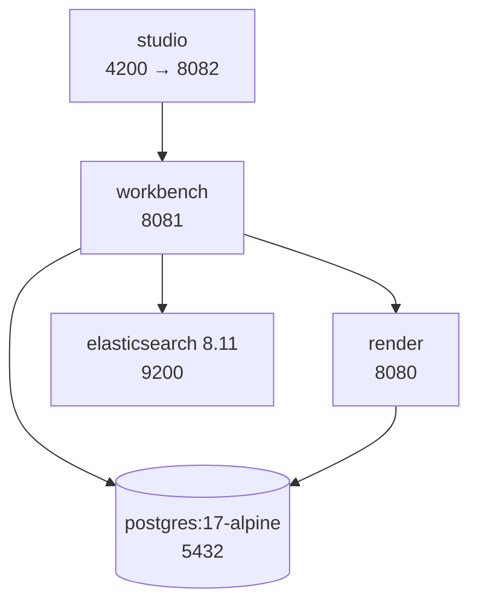
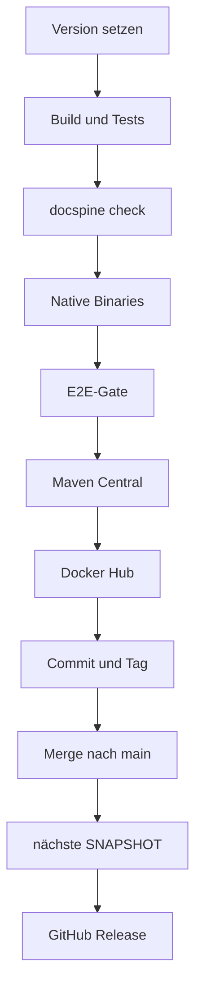

# Verteilungssicht

blocpress wird als Container-Images ausgeliefert: ein All-in-one-Image für den schnellen
Einstieg und je ein Image für render, workbench und studio. Dazu kommen zwei
docker-compose-Dateien für den lokalen Betrieb aus dem Quellcode. Wie viel CPU und Speicher
render braucht und wie es in Kubernetes läuft, steht in der Anleitung
[render bemessen](guides/render-sizing.md) mit dem Beispiel
[blocpress-render-k8s.yaml](guides/examples/blocpress-render-k8s.yaml); das wird hier nicht
wiederholt.

## Images

| Image | Inhalt | Port | Dockerfile |
|---|---|---|---|
| `flaechsig/blocpress-studio-quickstart` | studio, workbench, render, PostgreSQL, Elasticsearch | 8080, 8081, 9200 | `docker/studio/Dockerfile.native` (Release), `docker/studio/Dockerfile` (JVM, nur lokal) |
| `flaechsig/blocpress-render` | render, LibreOffice (`libreoffice-core`, `libreoffice-writer`), Schriften | 8080 | `blocpress-render/Dockerfile.native`, `Dockerfile` |
| `flaechsig/blocpress-workbench` | workbench, `poppler-utils`, ImageMagick (für den PDF-Vergleich) | 8081 | `blocpress-workbench/Dockerfile.native`, `Dockerfile` |
| `flaechsig/blocpress-studio` | studio | 8082 | `blocpress-studio/Dockerfile.native`, `Dockerfile` |

Alle Images bauen auf `ubuntu:24.04` auf. Die JVM-Varianten bringen `openjdk-21-jre-headless`
mit und starten `quarkus-run.jar`; die nativen Varianten kopieren das GraalVM-Binary
(`target/*-runner`) und brauchen kein JRE. Jedes Einzel-Image hat einen Healthcheck auf
`/q/health/ready` am eigenen Port. Veröffentlicht werden nur die nativen Varianten, jeweils
als `:X.Y.Z` und `:latest` (siehe [Release](#release-releaseyml)).

_(confidence: verified — die sechs Dockerfiles unter blocpress-render/, blocpress-workbench/,
blocpress-studio/, docker/studio/Dockerfile und Dockerfile.native, .github/workflows/release.yml)_

## Quickstart-Image

Start:

```bash
docker run -d -p 8080:8080 -p 8081:8081 --name blocpress flaechsig/blocpress-studio-quickstart:latest
```



**Start im Container.**

1. `entrypoint.sh` startet PostgreSQL 16 mit `pg_ctlcluster 16 main start`. PostgreSQL läuft
   damit außerhalb von supervisord und wird nicht neu gestartet, wenn es abbricht.
2. Danach legt `init-studio.sql` idempotent den Benutzer `blocpress` und die Datenbanken
   `workbench` und `production` mit allen Tabellen an, auch `render_job`. Angemeldet wird
   lokal ohne Passwort (`trust` für `local` und `127.0.0.1`).
3. Zuletzt setzt das Skript `BLOCPRESS_LO_WORKERS` auf 1, falls nicht gesetzt, und übergibt
   an supervisord.

| Prozess (supervisord) | Port | Besonderheit |
|---|---|---|
| `elasticsearch` | 9200, nur `127.0.0.1` | startet zuerst (`priority=5`) als eigener Benutzer, Single-Node, ohne Security, Heap 256 MB |
| `studio` | 8080, öffentlich | `WORKBENCH_URL=http://localhost:8082` |
| `workbench` | 8082, nur intern | wartet, bis Elasticsearch auf `/_cluster/health` antwortet; Datenbank `workbench`, `RENDER_URL=http://localhost:8081`, `ELASTICSEARCH_HOSTS=localhost:9200` |
| `render` | 8081, öffentlich | Datenbank `production`, `blocpress.libreoffice.workers` aus `BLOCPRESS_LO_WORKERS` (Obergrenze) |

Alle vier laufen mit `autorestart` und schreiben nach `/var/log/supervisor/<name>.log`.
workbench und render setzen `QUARKUS_HIBERNATE_ORM_SCHEMA_MANAGEMENT_STRATEGY=update` und
weichen damit von ihrem Standard `validate` ab. Der Healthcheck des Images prüft nur das
Studio (`/q/health/ready` auf 8080), nicht workbench oder render. Das Image deklariert kein
Volume; Vorlagen, Aufträge und Suchindex gehen mit dem Container verloren.

| Port | Dienst |
|---|---|
| 8080 | Studio: Oberfläche, `/api/*` als Proxy zur Workbench, `/proxy/bp-workbench.js` |
| 8081 | render: REST-API, Swagger UI unter `/q/swagger-ui` |
| 9200 | im Image freigegeben (`EXPOSE`), Elasticsearch lauscht aber nur auf `127.0.0.1` |
| 8082 | Workbench, nur im Container |

| Variable | Voreinstellung | Wirkung |
|---|---|---|
| `BLOCPRESS_LO_WORKERS` | 1 | Obergrenze für gleichzeitige Konvertierungen und Auftragsschleifen in render; render teilt sich die CPU hier mit den anderen Diensten |
| `BLOCPRESS_AUTH_ENABLED` | nicht gesetzt, also aus | JWT-Prüfung in render ([ADR-0002](09-decisions/ADR-0002.md)) |
| `MP_JWT_VERIFY_PUBLICKEY` | eingebauter Entwicklungsschlüssel | wirkt nur in render und nur mit `BLOCPRESS_AUTH_ENABLED=true` |
| `MP_JWT_VERIFY_ISSUER` | `https://blocpress.dev` | wie oben |
| `JAVA_OPTS_STUDIO`, `JAVA_OPTS_WORKBENCH`, `JAVA_OPTS_RENDER` | leer | JVM-Optionen, nur im JVM-Image (`Dockerfile`) |

_(confidence: verified — docker/studio/Dockerfile, Dockerfile.native, entrypoint.sh,
supervisord.conf, supervisord.native.conf, init-studio.sql; Swagger UI über
`quarkus.swagger-ui.always-include=true` in blocpress-render/src/main/resources/application.properties;
derived_from: arc42.adoc:1353-1432 legacy (git history))_

Weitere Variablen der Dienste, etwa `BLOCPRESS_DEFAULT_LOCALE`, kommen über `docker run -e`
in den Prozessen an, weil supervisord seine Umgebung weitergibt. Was in der
supervisord-Konfiguration fest steht (Ports, Datenbank, `RENDER_URL`, `WORKBENCH_URL`,
`ELASTICSEARCH_HOSTS`), lässt sich so nicht überschreiben.

_(confidence: unverified — Verhalten von supervisord, im Container nicht ausprobiert)_

Ohne `BLOCPRESS_AUTH_ENABLED=true` hat das Token im Quickstart keine Schutzwirkung: Das
Studio verlangt nur irgendeinen eingegebenen Text (siehe [blocpress-studio](05-building-blocks/studio.md)),
die Workbench prüft kein Token ([ADR-0003](09-decisions/ADR-0003.md)), render prüft es nur
mit eingeschalteter Absicherung. Das Studio und die Kommentare im Dockerfile verweisen für das
Entwicklungs-Token auf `docs/samples/quickstart/token.txt`; diese Datei gibt es nicht, sie
liegt unter `site/samples/quickstart/token.txt`.

_(confidence: verified — bp-app.js, bp-token-input.js, docker/studio/Dockerfile,
site/samples/quickstart/token.txt)_

Die Dateien `docker/studio/nginx.conf` und `docker/studio/studio.html` werden von keinem
Dockerfile kopiert. Sie stammen aus einer früheren Variante, in der nginx statt des Studios
auf Port 8080 lag.

_(confidence: verified — Suche nach den Dateinamen in Dockerfiles, Compose-Dateien und
Workflows)_

Gegenüber dem Altbestand korrigiert: Das All-in-one-Image heißt
`flaechsig/blocpress-studio-quickstart`, `flaechsig/blocpress-studio` ist nur das Studio. Es
enthält auch Elasticsearch, und PostgreSQL startet über `entrypoint.sh`, nicht über
supervisord. `RENDER_URL` ist eine Variable der Workbench, nicht des Studios. Die
JWT-Variablen wirken nicht allgemein, sondern nur in render bei eingeschalteter Absicherung.

Entschieden (2026-10-06): Elasticsearch bleibt im Quickstart intern. Port 9200 wird aus
`EXPOSE` und den Startbefehlen entfernt ([US-0046](01-goals/stories/US-0046.md)).

- UNKNOWN — offene Frage: Kann LibreOffice im Quickstart per WebDAV mit der Workbench arbeiten? Port 8082 ist nicht freigegeben, und der Studio-Proxy leitet nur GET, POST, PUT und DELETE weiter, kein PROPFIND.

## docker-compose

`docker-compose.yml` baut die drei Dienste aus ihren JVM-Dockerfiles und startet sie mit
PostgreSQL und Elasticsearch. `docker-compose.native.yml` ist ein Override, der auf die
nativen Dockerfiles umstellt und render auf 640 MB begrenzt; die Binaries müssen vorher mit
`mvn package -Dnative -pl blocpress-render,blocpress-workbench,blocpress-studio -am -DskipTests`
gebaut sein. Start: `docker compose -f docker-compose.yml -f docker-compose.native.yml up --build`.



| Dienst | Host-Port | Wesentliche Einstellungen |
|---|---|---|
| `postgres` | 5432 | Datenbank `workbench`, Benutzer und Passwort `workbench`; `docker/01-init.sql` und `docker/02-init-production.sh` legen Tabellen und die Datenbank `production` an |
| `elasticsearch` | 9200 | Single-Node, ohne Security, Heap 256 MB, Volume `elasticsearch_data` |
| `workbench` | 8081 | `QUARKUS_PROFILE=dev`, `RENDER_URL=http://render:8080`, `ELASTICSEARCH_HOSTS=elasticsearch:9200`; startet, wenn PostgreSQL und Elasticsearch gesund sind |
| `render` | 8080 | `QUARKUS_PROFILE=dev`, Datenbank `production`, `BLOCPRESS_LO_WORKERS=2`, `cpus: "2"`, `mem_limit: 768m` |
| `studio` | 4200 | `WORKBENCH_URL=http://workbench:8081` |

_(confidence: verified — docker-compose.yml, docker-compose.native.yml,
docker/01-init.sql, docker/02-init-production.sh; derived_from:
arc42.adoc:1434-1584 legacy (git history))_

Anders als im Quickstart ist die Workbench hier direkt auf Port 8081 erreichbar, auch für
WebDAV. Die Variablen `API_WORKBENCH_URL` und `API_RENDER_URL` am Studio liest kein Code.

Die Init-Skripte sind veraltet: Es fehlen unter anderem `valid_until` und die Tabelle
`render_job`. render prüft das Schema auch im Profil `dev` nur (`validate`) und scheitert
laut [US-0039](01-goals/stories/US-0039.md) daran. Die Workbench läuft im Profil `dev` mit
`update` und ergänzt fehlende Spalten selbst.

_(confidence: verified — Init-Skripte gegen docker/studio/init-studio.sql verglichen;
`quarkus.hibernate-orm.schema-management.strategy` in den application.properties von render
und workbench; der Startfehler selbst nicht ausprobiert)_

Gegenüber dem Altbestand korrigiert: Es gibt keine Dienste proof und admin, keine Schemata
einer Datenbank über `currentSchema`, sondern zwei Datenbanken, kein LibreOffice in der
Workbench, keine OpenTelemetry-Variablen und kein `LIBREOFFICE_HOME`. Ports und Images sind
die oben genannten.

## PostgreSQL-Version

> [!NOTE]
> Festgelegt ist PostgreSQL 18 oder neuer (Entscheidung 2026-10-05, siehe
> [Randbedingungen](02-constraints.md) und [US-0039](01-goals/stories/US-0039.md)). Tatsächlich laufen: im Quickstart-Image
> PostgreSQL 16 (Paket `postgresql` aus Ubuntu 24.04, `pg_ctlcluster 16`), in
> docker-compose `postgres:17-alpine`, im Kubernetes-Beispiel und im Lasttest
> (`RenderTarget`) `postgres:16`. Der Widerspruch ist in den Randbedingungen vermerkt.

_(confidence: contradicted — docker/studio/Dockerfile, entrypoint.sh, docker-compose.yml,
docs/guides/examples/blocpress-render-k8s.yaml,
blocpress-e2e/src/test/java/io/github/flaechsig/blocpress/e2e/load/RenderTarget.java)_

## Bemessung und Kubernetes

Siehe [render bemessen](guides/render-sizing.md). Die Kubernetes-Topologie des Altbestands
(Deployments für proof und admin, drei render-Replicas, PostgreSQL mit Replica,
Elasticsearch mit zwei Knoten, Ingress, ein gemeinsames PVC für vier Schemata,
OpenTelemetry) ist nicht übernommen: Außer dem render-Beispiel gibt es im Repository keine
Manifeste dafür.

_(confidence: verified — einziges Manifest im Repository ist
docs/guides/examples/blocpress-render-k8s.yaml; derived_from:
arc42.adoc:1586-1732 legacy (git history))_

## Build- und Release-Pipeline

Drei Workflows unter `.github/workflows/`.

### CI (`ci.yml`)

Läuft bei jedem Push auf `main` und `workbench-*` und bei Pull Requests gegen `main`.

1. Java 21 (Temurin) mit Maven-Cache einrichten.
2. LibreOffice ohne Oberfläche (`libreoffice-writer-nogui`), `poppler-utils` und ImageMagick
   installieren, mit 10 Minuten Zeitlimit.
3. `mvn -B clean verify -pl blocpress-core,blocpress-render,blocpress-workbench,blocpress-studio`
   mit `TESTCONTAINERS_RYUK_DISABLED=true`.
4. `python3 .docspine/docspine.pyz check` als Gate.

Die Integrationstests von render und studio sind per Voreinstellung aus (`skipITs=true` in
ihren POMs) und laufen in CI nicht; das Modul `blocpress-e2e` läuft nur im Release.
Branches nach dem Schema `docs/…` oder `feat/…` werden erst über einen Pull Request gebaut.

_(confidence: verified — .github/workflows/ci.yml, blocpress-render/pom.xml,
blocpress-studio/pom.xml; derived_from: arc42.adoc:1738-1743 legacy (git history))_

### Release (`release.yml`)

Manuell über `workflow_dispatch` mit den Eingaben `version` (z. B. `2.8.0`) und
`next_version` (ohne `-SNAPSHOT`). Alternativ von der Kommandozeile mit
`mvn validate -Ptrigger-release -Drelease.version=2.8.0 -Drelease.next=2.9.0`: Das Profil
pusht den aktuellen Branch, startet den Workflow mit `gh workflow run` auf diesem Branch und
verfolgt ihn mit `gh run watch`.



| Schritt | Aktion |
|---|---|
| Version setzen | `mvn versions:set -DnewVersion=X.Y.Z`, Version der Website in `site/index.html` anpassen, lokal committen |
| Build und Tests | wie CI: LibreOffice installieren, `mvn -B clean verify` für core, render, workbench, studio, dann `docspine check` |
| Native Binaries | `mvn clean package -Dnative -pl blocpress-studio,blocpress-render,blocpress-workbench --also-make -DskipTests`, gebaut im Container |
| E2E-Gate | Quickstart-Image aus `docker/studio/Dockerfile.native` lokal bauen, `mvn -B verify -pl blocpress-e2e -De2e.skip=false -Dstudio.image=…` dagegen |
| Maven Central | GPG-Schlüssel importieren, `mvn deploy -pl blocpress-core --also-make -Prelease -DskipTests` über `central-publishing-maven-plugin` mit `autoPublish` |
| Docker Hub | Quickstart-Image und die nativen Images von render, workbench und studio bauen und pushen, je `:X.Y.Z` und `:latest`; Beschreibung von `flaechsig/blocpress-studio-quickstart` aus `docker/README.md` |
| Commit und Tag | Release-Commit pushen, Tag `vX.Y.Z` setzen und pushen |
| Merge | läuft der Workflow nicht auf `main`: Branch mit `--no-ff` nach `main` mergen, danach den Branch löschen |
| Nächste Version | `mvn versions:set -DnewVersion=<next>-SNAPSHOT` auf `main` committen und pushen |
| GitHub Release | Abschnitt `## [X.Y.Z]` aus `CHANGELOG.md` als Text, Release `blocpress vX.Y.Z` |

**Gates.** Tests, `docspine check`, nativer Build und E2E-Suite laufen vor allem, was sich
nicht zurücknehmen lässt. Scheitert einer davon, ist nichts veröffentlicht und nichts
gepusht; der Versions-Commit bleibt lokal im Runner. Nach dem Deploy auf Maven Central gibt
es kein Gate mehr: Scheitert danach Docker Hub oder der Push, ist blocpress-core
veröffentlicht, ohne dass Tag und Images existieren.

**Secrets** (nur die Namen): `MAVEN_CENTRAL_USERNAME`, `MAVEN_CENTRAL_TOKEN`,
`GPG_PRIVATE_KEY`, `GPG_PASSPHRASE`, `DOCKERHUB_USERNAME`, `DOCKERHUB_TOKEN`. Für Commits,
Tag und Release nutzt der Workflow das Standard-Token mit `contents: write`.

**Versionskonvention.** `main` trägt immer eine SNAPSHOT-Version (derzeit `2.8.0-SNAPSHOT`).
Der Tag `vX.Y.Z` zeigt auf den Commit ohne `-SNAPSHOT`. Auf Maven Central erscheint nur
blocpress-core; render, workbench und studio sind lauffähige Anwendungen und werden nur als
Images veröffentlicht.

_(confidence: verified — .github/workflows/release.yml, pom.xml (Profile `trigger-release`,
`release`, `native`), CHANGELOG.md; derived_from: arc42.adoc:1745-1807 legacy (git history))_

`docker/README.md` beschreibt das render-Image (`docker run … flaechsig/blocpress-render`),
wird aber als Beschreibung von `flaechsig/blocpress-studio-quickstart` veröffentlicht. Die
Repositories der Einzel-Images bekommen vom Workflow keine Beschreibung.

_(confidence: verified — docker/README.md, release.yml Schritt „Docker Hub README
aktualisieren“)_

Gegenüber dem Altbestand korrigiert: CI testet alle vier Module mit LibreOffice und endet mit
`docspine check`, statt nur core und workbench. Im Release kommen der native Build, das
E2E-Gate, `docspine check` und die drei Einzel-Images hinzu. Die Website liegt in
`site/index.html`, nicht in `docs/index.html`; der Docker-Hub-Text kommt aus
`docker/README.md`, nicht aus `docs/dockerhub.md`.

### Website (`pages.yml`)

Veröffentlicht `site/` auf GitHub Pages, bei Pushes auf `main`, die Dateien unter `site/`
ändern, oder manuell. Rechte: `pages: write`, `id-token: write`; Läufe sind über die Gruppe
`pages` serialisiert.

_(confidence: verified — .github/workflows/pages.yml)_

Nach einem Release erscheint die neue Version nicht auf der Website: Der Release pusht mit
dem Standard-Token des Workflows, und solche Pushes starten keine weiteren Workflows. Nach den
Releases 2.6.0 und 2.7.0 (2.–3.10.2026) lief `pages.yml` erst beim Merge am 5.10.2026.
Entschieden (2026-10-06): `pages.yml` startet zusätzlich per `workflow_run`, wenn `release.yml`
erfolgreich endet ([US-0047](01-goals/stories/US-0047.md)).

_(confidence: verified — `gh run list` für release.yml und pages.yml)_
