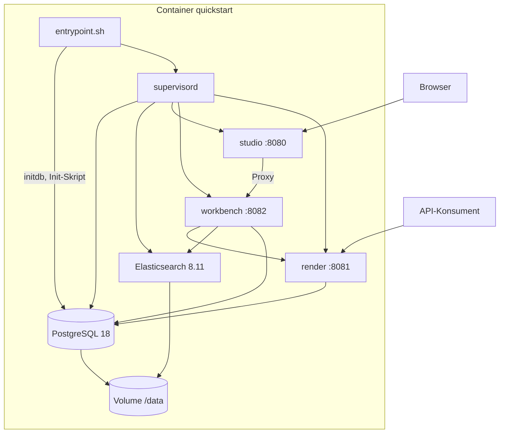
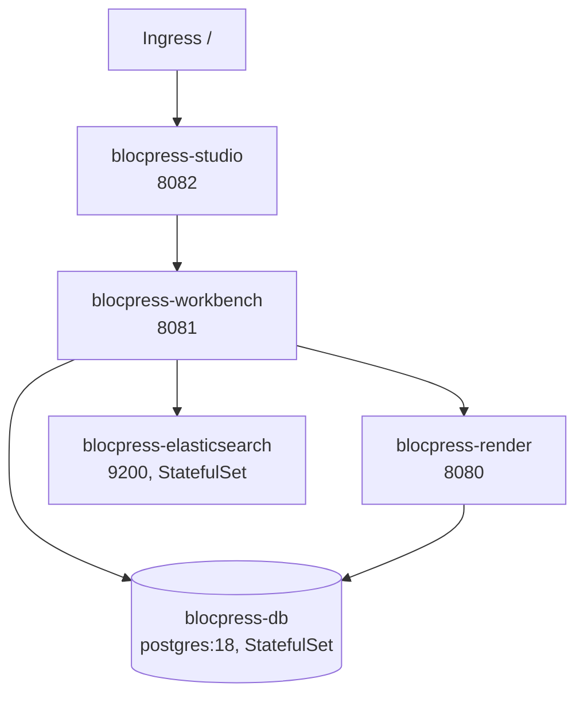
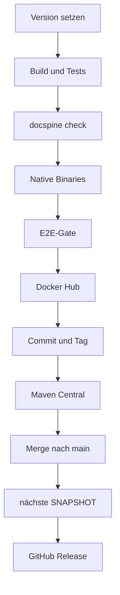

# Verteilungssicht

blocpress wird als Container-Images ausgeliefert: ein All-in-one-Image für den schnellen
Einstieg und je ein Image für render, workbench und studio für den Betrieb in Kubernetes
([ADR-0014](09-decisions/ADR-0014.md)). Wie viel CPU und Speicher
render braucht und wie es in Kubernetes läuft, steht in der Anleitung
[render bemessen](guides/render-sizing.md) mit dem Beispiel
[blocpress-render-k8s.yaml](guides/examples/blocpress-render-k8s.yaml); das wird hier nicht
wiederholt.

## Images

| Image | Inhalt | Port | Dockerfile |
|---|---|---|---|
| `flaechsig/blocpress-studio-quickstart` | studio, workbench, render, PostgreSQL, Elasticsearch | 8080, 8081, 9200 | `docker/studio/Dockerfile.native` (Release), `docker/studio/Dockerfile` (JVM, nur lokal) |
| `flaechsig/blocpress-render` | render, LibreOffice (`libreoffice-core`, `libreoffice-writer`), Schriften | 8080 | `blocpress-render/Dockerfile.native`, `Dockerfile` |
| `flaechsig/blocpress-workbench` | workbench, `poppler-utils`, ImageMagick (für den PDF-Vergleich) | 8081 | `blocpress-workbench/Dockerfile.native`, `Dockerfile` |
| `flaechsig/blocpress-studio` | studio | 8082 | `blocpress-studio/Dockerfile.native`, `Dockerfile` |

Alle Images bauen auf `ubuntu:24.04` auf. Die JVM-Varianten bringen `openjdk-21-jre-headless`
mit und starten `quarkus-run.jar`; die nativen Varianten kopieren das GraalVM-Binary
(`target/*-runner`) und brauchen kein JRE. Jedes Einzel-Image hat einen Healthcheck auf
`/q/health/ready` am eigenen Port. Veröffentlicht werden nur die nativen Varianten, jeweils
als `:X.Y.Z` und `:latest` (siehe [Release](#release-releaseyml)).

_(confidence: verified — die sechs Dockerfiles unter blocpress-render/, blocpress-workbench/,
blocpress-studio/, docker/studio/Dockerfile und Dockerfile.native, .github/workflows/release.yml)_

## Quickstart-Image

Start:

```bash
docker run -d -p 8080:8080 -p 8081:8081 -v blocpress-data:/data --name blocpress flaechsig/blocpress-studio-quickstart:latest
```

Ohne `-v` legt Docker ein anonymes Volume an; die Daten bleiben dann nur, solange der
Container nicht gelöscht wird.



**Start im Container.**

1. `entrypoint.sh` legt im Volume `/data` die Verzeichnisse `postgresql` und
   `elasticsearch` an und, wenn `postgresql` noch keinen Cluster enthält, mit `initdb` einen
   neuen (PostgreSQL 18 aus dem PGDG-Repository).
2. Es startet PostgreSQL kurz mit `pg_ctl`; `init-studio.sql` legt idempotent den Benutzer
   `blocpress` und die leeren Datenbanken `workbench` und `production` an. Die Tabellen legen
   die Dienste beim Start selbst an ([ADR-0015](09-decisions/ADR-0015.md)). Angemeldet wird
   lokal ohne Passwort (`trust` für `local` und `127.0.0.1`). Danach stoppt es PostgreSQL
   wieder.
3. Zuletzt setzt das Skript `BLOCPRESS_LO_WORKERS` auf 1, falls nicht gesetzt, und übergibt
   an supervisord.

| Prozess (supervisord) | Port | Besonderheit |
|---|---|---|
| `postgresql` | 5432, nur `localhost` | startet zuerst (`priority=1`) als Benutzer `postgres`, Daten in `/data/postgresql` |
| `elasticsearch` | 9200, nur `127.0.0.1` | `priority=5`, eigener Benutzer, Single-Node, ohne Security, Heap 256 MB, Daten in `/data/elasticsearch` |
| `studio` | 8080, öffentlich | `WORKBENCH_URL=http://localhost:8082` |
| `workbench` | 8082, nur intern | wartet, bis PostgreSQL (`pg_isready`) und Elasticsearch auf `/_cluster/health` antwortet; Datenbank `workbench`, `RENDER_URL=http://localhost:8081`, `ELASTICSEARCH_HOSTS=localhost:9200` |
| `render` | 8081, öffentlich | wartet auf PostgreSQL; Datenbank `production`, `blocpress.libreoffice.workers` aus `BLOCPRESS_LO_WORKERS` (Obergrenze) |

Alle fünf laufen mit `autorestart` und schreiben nach `/var/log/supervisor/<name>.log`;
bricht PostgreSQL ab, startet supervisord es neu. Der Healthcheck des Images ist erst grün,
wenn studio (8080), render (8081) und workbench (8082) auf `/q/health/ready` antworten; die
Readiness von render und workbench schließt die Datenbank ein, die der Workbench auch
Elasticsearch. Vorlagen, Aufträge und Suchindex liegen im Volume `/data` und überstehen das
Löschen des Containers.

| Port | Dienst |
|---|---|
| 8080 | Studio: Oberfläche, `/api/*` als Proxy zur Workbench (auch WebDAV unter `/api/webdav`), `/proxy/bp-workbench.js` |
| 8081 | render: REST-API, Swagger UI unter `/q/swagger-ui` |
| 8082 | Workbench, nur im Container |
| 5432, 9200 | PostgreSQL und Elasticsearch, nur im Container |

| Variable | Voreinstellung | Wirkung |
|---|---|---|
| `BLOCPRESS_LO_WORKERS` | 1 | Obergrenze für gleichzeitige Konvertierungen und Auftragsschleifen in render; render teilt sich die CPU hier mit den anderen Diensten |
| `BLOCPRESS_AUTH_ENABLED` | nicht gesetzt, also aus | JWT-Prüfung in render ([ADR-0002](09-decisions/ADR-0002.md)) |
| `BLOCPRESS_CORS_ORIGINS` | nicht gesetzt, also nur same-origin | fremde Origins, die render und workbench aus dem Browser aufrufen dürfen, kommagetrennt; das Studio braucht keine, es leitet alles weiter |
| `MP_JWT_VERIFY_PUBLICKEY` | eingebauter Entwicklungsschlüssel | wirkt nur in render und nur mit `BLOCPRESS_AUTH_ENABLED=true` |
| `MP_JWT_VERIFY_ISSUER` | `https://blocpress.dev` | wie oben |
| `JAVA_OPTS_STUDIO`, `JAVA_OPTS_WORKBENCH`, `JAVA_OPTS_RENDER` | leer | JVM-Optionen, nur im JVM-Image (`Dockerfile`) |

_(confidence: verified — docker/studio/Dockerfile, Dockerfile.native, entrypoint.sh,
supervisord.conf, supervisord.native.conf, init-studio.sql; Swagger UI über
`quarkus.swagger-ui.always-include=true` in blocpress-render/src/main/resources/application.properties;
derived_from: arc42.adoc:1353-1432 legacy (git history))_

Weitere Variablen der Dienste, etwa `BLOCPRESS_DEFAULT_LOCALE`, kommen über `docker run -e`
in den Prozessen an, weil supervisord seine Umgebung weitergibt. Was in der
supervisord-Konfiguration fest steht (Ports, Datenbank, `RENDER_URL`, `WORKBENCH_URL`,
`ELASTICSEARCH_HOSTS`), lässt sich so nicht überschreiben.

_(confidence: unverified — Verhalten von supervisord, im Container nicht ausprobiert)_

Ohne `BLOCPRESS_AUTH_ENABLED=true` hat das Token im Quickstart keine Schutzwirkung: Das
Studio verlangt nur irgendeinen eingegebenen Text (siehe [blocpress-studio](05-building-blocks/studio.md)),
die Workbench prüft kein Token ([ADR-0003](09-decisions/ADR-0003.md)), render prüft es nur
mit eingeschalteter Absicherung. Das Studio und die Kommentare im Dockerfile verweisen für das
Entwicklungs-Token auf `docs/samples/quickstart/token.txt`; diese Datei gibt es nicht, sie
liegt unter `site/samples/quickstart/token.txt`.

_(confidence: verified — bp-app.js, bp-token-input.js, docker/studio/Dockerfile,
site/samples/quickstart/token.txt)_

Gegenüber dem Altbestand korrigiert: Das All-in-one-Image heißt
`flaechsig/blocpress-studio-quickstart`, `flaechsig/blocpress-studio` ist nur das Studio. Es
enthält auch Elasticsearch. `RENDER_URL` ist eine Variable der Workbench, nicht des Studios. Die
JWT-Variablen wirken nicht allgemein, sondern nur in render bei eingeschalteter Absicherung.

Seit [US-0046](01-goals/stories/US-0046.md) (2026-10-06): Elasticsearch bleibt intern, Port
9200 ist nicht mehr freigegeben. LibreOffice arbeitet per WebDAV über das Studio
(`http://localhost:8080/api/webdav/templates/<name>.odt`): Der Proxy leitet OPTIONS, HEAD,
PROPFIND, LOCK und UNLOCK samt WebDAV-Headern weiter und macht eine `Location` der Workbench
serverrelativ ([REQ-0029](01-goals/requirements/REQ-0029.md)).

_(confidence: verified — im JVM-Image ausprobiert: PROPFIND, PUT mit `Location`, GET über
Port 8080; LibreOffice öffnete die Vorlage über `vnd.sun.star.webdav://` und exportierte sie)_

## docker-compose

Entfernt am 2026-10-06 ([ADR-0014](09-decisions/ADR-0014.md)): `docker-compose.yml`,
`docker-compose.native.yml` und die Init-Skripte `docker/01-init.sql` und
`docker/02-init-production.sh`. Die Skripte waren veraltet, render scheiterte damit an der
Schemaprüfung ([US-0039](01-goals/stories/US-0039.md)). Das Sysadmin-Tutorial der Website
beschreibt seit [US-0051](01-goals/stories/US-0051.md) den Betrieb in Kubernetes.

## PostgreSQL-Version

Alle Lieferwege nutzen PostgreSQL 18 ([Randbedingungen](02-constraints.md)): das
Quickstart-Image (Paket `postgresql-18` aus dem PGDG-Repository), die Manifeste unter
`deploy/k8s`, das Kubernetes-Beispiel zur Bemessung und der Lasttest (`RenderTarget`), seit
[US-0046](01-goals/stories/US-0046.md).

_(confidence: verified — docker/studio/Dockerfile, Dockerfile.native,
deploy/k8s/postgres/postgres.yaml, docs/guides/examples/blocpress-render-k8s.yaml,
blocpress-e2e/src/test/java/io/github/flaechsig/blocpress/e2e/load/RenderTarget.java)_

## Kubernetes

Für den Betrieb liefert blocpress Kustomize-Manifeste unter `deploy/k8s`
([ADR-0014](09-decisions/ADR-0014.md), [US-0051](01-goals/stories/US-0051.md)); die Anleitung
ist das Sysadmin-Tutorial der Website (`site/tutorial-sysadmin.html`). Installiert wird mit
`kubectl apply -k "github.com/flaechsig/blocpress/deploy/k8s?ref=v<Version>"` in den Namespace
`blocpress`, nachdem dort das Secret `blocpress-db` (Schlüssel `username`, `password`)
angelegt ist.



| Teil | Inhalt |
|---|---|
| `deploy/k8s/app` | render (2 CPU, 640Mi), workbench (768Mi), studio (256Mi), Elasticsearch 8.11.0 (ein Knoten, ohne Security, 1Gi Volume); render und workbench warten in einem Init-Container auf `blocpress-db:5432` |
| `deploy/k8s/postgres` | PostgreSQL 18 mit 2Gi Volume; ein Init-Skript legt die leeren Datenbanken `workbench` und `production` an |
| `deploy/k8s` | beide Teile plus Ingress für das Studio unter `/` |

Die Tabellen legen render und workbench beim Start selbst an
([ADR-0015](09-decisions/ADR-0015.md)). Wer eine eigene Datenbank betreibt, nimmt nur
`deploy/k8s/app` und lässt den Dienstnamen `blocpress-db` auf seinen Server zeigen. Die
Image-Tags in `deploy/k8s/app/kustomization.yaml` und die Version im Tutorial setzt der
Release-Workflow. render ist nicht über den Ingress erreichbar: Sein Import-Endpunkt ist ohne
Anmeldung und nur für die Workbench gedacht.

_(confidence: verified — deploy/k8s; am 2026-10-06 in k3d v5.8.3 (k3s v1.31.5) mit lokal
gebauten Images durchgespielt, siehe [US-0051](01-goals/stories/US-0051.md))_

Zur Bemessung von render siehe [render bemessen](guides/render-sizing.md); das Beispiel
`docs/guides/examples/blocpress-render-k8s.yaml` dort dient der Lastmessung. Die
Kubernetes-Topologie des Altbestands (Deployments für proof und admin, PostgreSQL mit Replica,
Elasticsearch mit zwei Knoten, ein gemeinsames PVC für vier Schemata, OpenTelemetry) ist nicht
übernommen.

_(confidence: verified — derived_from: arc42.adoc:1586-1732 legacy (git history))_

## Build- und Release-Pipeline

Drei Workflows unter `.github/workflows/`.

### CI (`ci.yml`)

Läuft bei jedem Push auf `main` und `workbench-*` und bei Pull Requests gegen `main`.

1. Java 21 (Temurin) mit Maven-Cache einrichten.
2. LibreOffice ohne Oberfläche (`libreoffice-writer-nogui`), `poppler-utils` und ImageMagick
   installieren, mit 10 Minuten Zeitlimit.
3. `mvn -B clean verify -pl blocpress-core,blocpress-render,blocpress-workbench,blocpress-studio`
   mit `TESTCONTAINERS_RYUK_DISABLED=true`.
4. `python3 .docspine/docspine.pyz check` als Gate.

Die Integrationstests von render und studio sind per Voreinstellung aus (`skipITs=true` in
ihren POMs) und laufen in CI nicht; das Modul `blocpress-e2e` läuft nur im Release.
Branches nach dem Schema `docs/…` oder `feat/…` werden erst über einen Pull Request gebaut.

_(confidence: verified — .github/workflows/ci.yml, blocpress-render/pom.xml,
blocpress-studio/pom.xml; derived_from: arc42.adoc:1738-1743 legacy (git history))_

### Release (`release.yml`)

Manuell über `workflow_dispatch` mit den Eingaben `version` (z. B. `2.8.0`) und
`next_version` (ohne `-SNAPSHOT`). Alternativ von der Kommandozeile mit
`mvn validate -Ptrigger-release -Drelease.version=2.8.0 -Drelease.next=2.9.0`: Das Profil
pusht den aktuellen Branch, startet den Workflow mit `gh workflow run` auf diesem Branch und
verfolgt ihn mit `gh run watch`.



| Schritt | Aktion |
|---|---|
| Version setzen | `mvn versions:set -DnewVersion=X.Y.Z`, Version der Website in `site/index.html` anpassen, lokal committen |
| Build und Tests | wie CI: LibreOffice installieren, `mvn -B clean verify` für core, render, workbench, studio, dann `docspine check` |
| Native Binaries | `mvn clean package -Dnative -pl blocpress-studio,blocpress-render,blocpress-workbench --also-make -DskipTests`, gebaut im Container |
| E2E-Gate | Quickstart-Image aus `docker/studio/Dockerfile.native` lokal bauen, `mvn -B verify -pl blocpress-e2e -De2e.skip=false -Dstudio.image=…` dagegen |
| Docker Hub | Quickstart-Image und die nativen Images von render, workbench und studio bauen und pushen, je `:X.Y.Z` und `:latest`; Beschreibung von `flaechsig/blocpress-studio-quickstart` aus `docker/README.quickstart.md`, von `flaechsig/blocpress-render` aus `docker/README.md` |
| Commit und Tag | Release-Commit pushen, Tag `vX.Y.Z` setzen und pushen |
| Maven Central | GPG-Schlüssel importieren, `mvn deploy -pl blocpress-core --also-make -Prelease -DskipTests` über `central-publishing-maven-plugin` mit `autoPublish`, auf dem getaggten Commit |
| Merge | läuft der Workflow nicht auf `main`: Branch mit `--no-ff` nach `main` mergen, danach den Branch löschen |
| Nächste Version | `mvn versions:set -DnewVersion=<next>-SNAPSHOT` auf `main` committen und pushen |
| GitHub Release | Abschnitt `## [X.Y.Z]` aus `CHANGELOG.md` als Text, Release `blocpress vX.Y.Z` |

**Gates.** Tests, `docspine check`, nativer Build und E2E-Suite laufen vor allem, was sich
nicht zurücknehmen lässt. Scheitert einer davon, ist nichts veröffentlicht und nichts
gepusht; der Versions-Commit bleibt lokal im Runner. Danach veröffentlicht der Release zuerst,
was sich zurücknehmen lässt (Images überschreiben, Tag löschen), und erst dann blocpress-core
auf Maven Central, das sich nicht zurücknehmen lässt ([US-0047](01-goals/stories/US-0047.md)).
Scheitert Docker Hub oder der Push, ist auf Central noch nichts erschienen. Scheitert Central,
sind Images und Tag schon da; Tag und gegebenenfalls Release-Commit müssen dann von Hand
zurückgenommen werden, bevor der Release neu läuft.

**Secrets** (nur die Namen): `MAVEN_CENTRAL_USERNAME`, `MAVEN_CENTRAL_TOKEN`,
`GPG_PRIVATE_KEY`, `GPG_PASSPHRASE`, `DOCKERHUB_USERNAME`, `DOCKERHUB_TOKEN`. Für Commits,
Tag und Release nutzt der Workflow das Standard-Token mit `contents: write`.

**Versionskonvention.** `main` trägt immer eine SNAPSHOT-Version (derzeit `2.8.0-SNAPSHOT`).
Der Tag `vX.Y.Z` zeigt auf den Commit ohne `-SNAPSHOT`. Auf Maven Central erscheint nur
blocpress-core; render, workbench und studio sind lauffähige Anwendungen und werden nur als
Images veröffentlicht.

_(confidence: verified — .github/workflows/release.yml, pom.xml (Profile `trigger-release`,
`release`, `native`), CHANGELOG.md; derived_from: arc42.adoc:1745-1807 legacy (git history))_

Die Repositories von `flaechsig/blocpress-workbench` und `flaechsig/blocpress-studio`
bekommen vom Workflow keine Beschreibung.

_(confidence: verified — docker/README.md, docker/README.quickstart.md, release.yml Schritte
„Docker Hub README …“)_

Gegenüber dem Altbestand korrigiert: CI testet alle vier Module mit LibreOffice und endet mit
`docspine check`, statt nur core und workbench. Im Release kommen der native Build, das
E2E-Gate, `docspine check` und die drei Einzel-Images hinzu. Die Website liegt in
`site/index.html`, nicht in `docs/index.html`; der Docker-Hub-Text kommt aus
`docker/README.md`, nicht aus `docs/dockerhub.md`.

### Website (`pages.yml`)

Veröffentlicht `site/` auf GitHub Pages, bei Pushes auf `main`, die Dateien unter `site/`
ändern, nach jedem erfolgreichen Release (`workflow_run` auf `Release`) oder manuell. Rechte: `pages: write`, `id-token: write`; Läufe sind über die Gruppe
`pages` serialisiert.

_(confidence: verified — .github/workflows/pages.yml)_

Der Start nach dem Release ist nötig, weil der Release mit dem Standard-Token des Workflows
pusht und solche Pushes keine weiteren Workflows starten. Nach den Releases 2.6.0 und 2.7.0
(2.–3.10.2026) lief `pages.yml` deshalb erst beim Merge am 5.10.2026
([US-0047](01-goals/stories/US-0047.md)).

_(confidence: verified — pages.yml; nach Release 2.7.1 per `workflow_run` gelaufen)_
