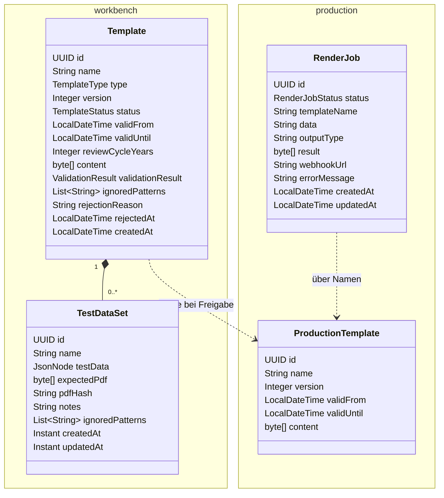
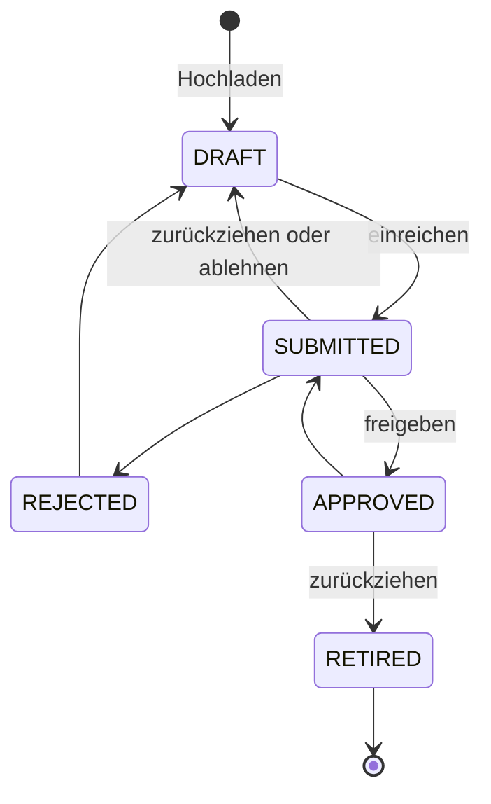

# Domänenmodell

Das Modell verteilt sich auf zwei PostgreSQL-Datenbanken: `workbench` für Gestaltung, Test
und Freigabe, `production` für das, was gerendert werden darf. Die Workbench schreibt nur in
`workbench`, render nur in `production`; der Übergang läuft über die REST-Übergabe bei der
Freigabe, nicht über SQL ([US-0017](../01-goals/stories/US-0017.md)).

_(confidence: verified — blocpress-workbench/src/main/java/io/github/flaechsig/blocpress/workbench/entity/Template.java,
TestDataSet.java, blocpress-render/src/main/java/io/github/flaechsig/blocpress/render/ProductionTemplate.java,
RenderJob.java, application.properties von workbench und render; derived_from:
arc42.adoc:1813-1924 legacy (git history), arc42.adoc:1972-2045 legacy (git history),
Element_Design_Concept.adoc:878-906 legacy (git history))_

## Template und Baustein (workbench)

Vorlagen und Textbausteine sind **eine** Entität `Template` in der Tabelle `template`.
`type` unterscheidet `TEMPLATE` (druckbare Vorlage, Standard) und `BAUSTEIN` (ODT-Fragment,
das über `text:section-source` eingebunden wird, siehe [Vorlagen](vorlagen.md)). Beide
durchlaufen denselben Lebenszyklus ([US-0013](../01-goals/stories/US-0013.md)).

| Feld | Bedeutung |
|---|---|
| `name`, `version`, `validFrom`, `validUntil`, `reviewCycleYears` | Versionierung und Gültigkeit, siehe [Versionierung](versionierung.md) |
| `content` | die ODT-Datei (bytea, lazy geladen) |
| `validationResult` | Ergebnis der Prüfung beim Hochladen (jsonb); nur gültige Vorlagen lassen sich einreichen |
| `ignoredPatterns` | reguläre Ausdrücke für Textstellen, die der Regressionsvergleich übergeht (jsonb) |
| `rejectionReason`, `rejectedAt` | Begründung und Zeitpunkt der letzten Ablehnung; beim erneuten Einreichen gelöscht |

Status (`TemplateStatus`) und erlaubte Übergänge:

Die Ablehnung über `POST …/{id}/reject` setzt den Status auf `DRAFT` und hält die
Begründung fest; `REJECTED` wird nur über den allgemeinen Statuswechsel
`PUT …/{id}/status` erreicht. Beim Übergang nach `APPROVED` wird die Vorlage nach
`production` kopiert; schlägt das fehl, antwortet die Workbench mit 503. Beim Übergang nach
`RETIRED` entfernt die Workbench die Vorlage aus dem Suchindex und lässt render alle
Einträge mit diesem Namen aus `production` löschen
([US-0016](../01-goals/stories/US-0016.md), [US-0019](../01-goals/stories/US-0019.md)).

_(confidence: verified — Template.java, TemplateStatus.java, TemplateType.java,
TemplateResource.java (`isValidTransition`, `reject`, `updateStatus`), TemplateImportResource.java;
derived_from: Element_Design_Concept.adoc:975-1003 legacy (git history),
Solution_Design_Concept.adoc:123-143 legacy (git history))_

Gegenüber dem Altbestand korrigiert: Die Status heißen nicht „Entwurf, In Prüfung,
Freigegeben, Archiviert“, sondern wie oben; `RETIRED` fehlt in Element Design Concept E-1.
Die IDs sind UUIDs, nicht `BIGSERIAL`; es gibt kein Feld `ersteller_id`, `user_fields` oder
`review_zyklus` und keine Tabelle für die Zuordnung Template–Baustein. Felder für Ersteller,
Freigeber und Freigabedatum gibt es nicht.

## TestDataSet (workbench)

Ein Testdatensatz gehört zu genau einer Vorlage und wird mit ihr gelöscht.

| Feld | Bedeutung |
|---|---|
| `name` | sprechender Name, z. B. „Standardfall“; je Vorlage eindeutig (nur im SQL-Skript, nicht in der Entität) |
| `testData` | die JSON-Daten (jsonb) |
| `expectedPdf`, `pdfHash` | optionales Soll-PDF für den Regressionsvergleich und sein SHA-256-Hash |
| `notes` | freie Notizen |
| `ignoredPatterns` | zusätzliche Ignoriermuster nur für diesen Testfall, ergänzen die der Vorlage |

([US-0011](../01-goals/stories/US-0011.md), [US-0012](../01-goals/stories/US-0012.md),
[US-0018](../01-goals/stories/US-0018.md))

_(confidence: verified — TestDataSet.java, Template.java (`cascade = ALL, orphanRemoval`),
docker/studio/init-studio.sql (`UNIQUE(template_id, name)`); derived_from:
Element_Design_Concept.adoc:1184-1215 legacy (git history))_

## ProductionTemplate (production)

Freigegebene Vorlagen in vereinfachter Form: `id` (dieselbe UUID wie in der Workbench),
`name`, `version`, `validFrom`, `validUntil`, `content`. Ein Status fehlt; was hier liegt, gilt
als freigegeben. Der Import ersetzt einen Eintrag mit gleicher `id`. Ältere Versionen
bleiben stehen, bis die Vorlage zurückgezogen wird. render hält den Inhalt bis zu 10 Minuten
in einem Cache (höchstens 100 Einträge); ein Import leert ihn.

_(confidence: verified — ProductionTemplate.java, TemplateImportResource.java, TemplateCache.java,
blocpress-render/src/main/resources/application.properties; derived_from:
Element_Design_Concept.adoc:847-876 legacy (git history))_

## RenderJob (production)

Ein Render-Auftrag mit Status `PENDING`, `PROCESSING`, `DONE` oder `FAILED`. Asynchrone
Aufträge holt ein Worker mit `FOR UPDATE SKIP LOCKED`; Aufträge, die länger als
`blocpress.async.stale-after` (Standard 10 Minuten) in `PROCESSING` hängen, gehen zurück auf
`PENDING`. Auch jeder synchrone Aufruf von `POST /api/render/{name}` wird als RenderJob
festgehalten. Ein stündlicher Lauf löscht zuerst die Ergebnis-Bytes
(`blocpress.async.result-retention`, Standard 24 Stunden) und später den ganzen Datensatz
(`blocpress.async.record-retention`, Standard 7 Tage) ([US-0006](../01-goals/stories/US-0006.md)).

_(confidence: verified — RenderJob.java, RenderJobStatus.java, RenderJobWorker.java
(`claimNextPending`, `requeueStaleJobs`, `cleanupJobs`, `recordSync`), application.properties;
derived_from: arc42.adoc:1883-1895 legacy (git history),
arc42.adoc:1990-1992 legacy (git history), arc42.adoc:2388-2422 legacy (git history))_

Aus dem Altbestand entfallen: die Schemata `proof` und `admin` mit Freigabeprozess,
ComplianceReview, TestCase, Testpool, Benutzer und AuditLog ([ADR-0003](../09-decisions/ADR-0003.md));
die Entität „Dokumentengenerierung“ (E-3) mit Template-ID, Version und Anforderer — an ihrer
Stelle steht RenderJob, der nur den Vorlagennamen kennt.

- UNKNOWN — offene Frage: Wer legt die Tabellen in einer produktiven Installation (Kubernetes, [ADR-0014](../09-decisions/ADR-0014.md)) an? Beide Dienste prüfen das Schema nur (Hibernate validate, die Workbench ergänzt im Profil dev); vollständig ist nur docker/studio/init-studio.sql im Quickstart-Image, das Kubernetes-Beispiel weicht auf update aus. Zu klären in US-0051.
